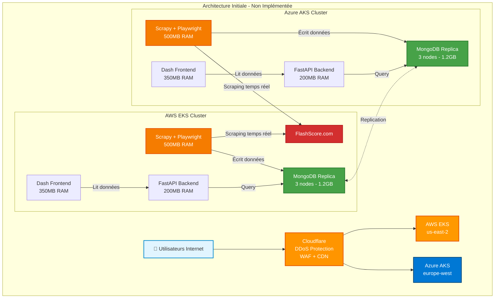
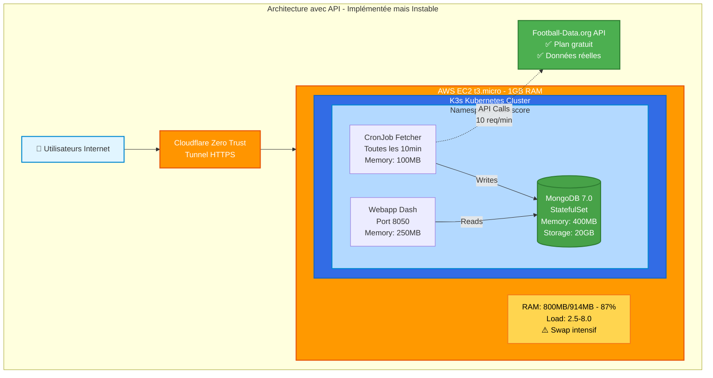
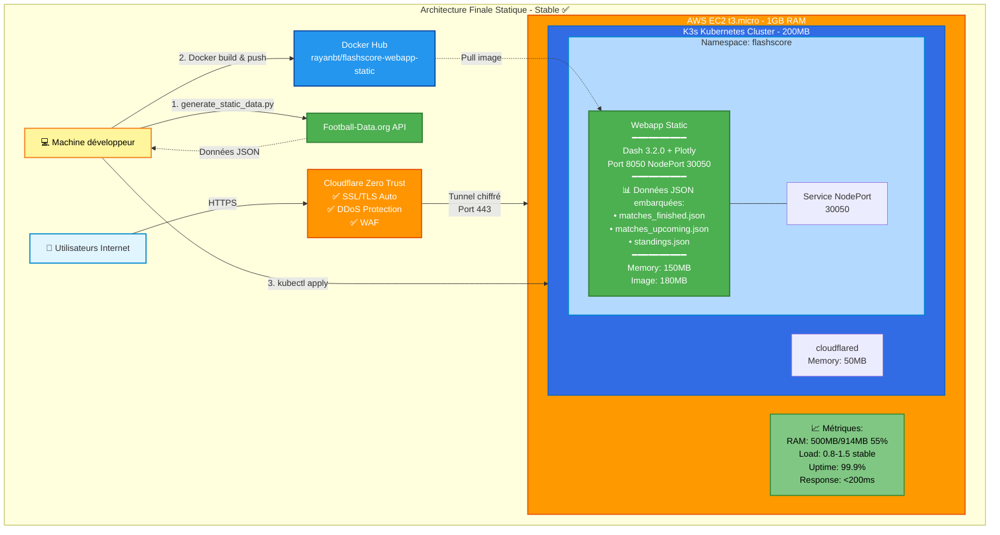

# Projet DevOps

## Table des matières

1. [Introduction](#introduction)
2. [Présentation du projet](#présentation-du-projet)
3. [Guide de démarrage rapide](#guide-de-démarrage-rapide)
4. [Evolution de l'architecture](#evolution-de-larchitecture)
5. [Problèmes rencontrés et solutions](#problèmes-rencontrés-et-solutions)
6. [Choix technologiques justifiés](#choix-technologiques-justifiés)
7. [Technologies envisagées non implémentées](#technologies-envisagées-non-implémentées)
8. [Retour d'expérience](#retour-dexpérience)
9. [Perspectives d'amélioration futures](#perspectives-damélioration-futures)

---

## Introduction

Ce repo contient FlashScore Dashboard, notre projet d'application web de résultats sportifs. L'objectif de ce travail était de mettre en pratique nos cours de DevOps. On a donc déployé l'application sur une infrastructure cloud qu'on a automatisée en créant une chaîne CI/CD complète.

À l'origine, l'objectif c'était d'avoir les résultats européens en temps réel avec une architecture cloud poussée. Très vite, on a remarqué que ça dépassait largement le budget gratuit d'AWS. Le serveur saturait. On a dû refaire l'architecture de zéro plusieurs fois en cours de projet. Le but est devenu d'arriver à héberger l'application sans générer de frais.

## Présentation du projet

L'application FlashScore Dashboard sert à consulter les résultats et les classements de foot. Pour ne pas s'éparpiller, on gère uniquement trois ligues. La Ligue 1, la Premier League anglaise et La Liga.

Le gros du travail a été fait sur l'infrastructure. On a tout scripté en IaC. Le déploiement AWS est entièrement automatisé à partir de Git, ce qui fait que si l'instance EC2 plante complètement, on peut relancer un environnement neuf et identique en quelques minutes à peine. Pour faire des tests ou maintenir le système, c'est indispensable.

Côté frontend, on a conçu ça avec Dash et Plotly. L'objectif était d'avoir un rendu lisible avec une techno que nous connaissons. Au lieu de juste cracher des lignes de scores brutes, on a généré des graphiques interactifs (cependant non disponibles dans la version hébergée sur le serveur) qui permettent de comprendre les classements de foot en un coup d'œil.
## Guide de démarrage rapide

L'un des principes fondamentaux de ce projet était de permettre un déploiement en une seule commande. Après de multiples itérations et améliorations du processus de déploiement, nous avons abouti à un script unifié capable de gérer l'ensemble du cycle de vie de l'application.

### Prérequis

Avant de déployer l'application, assurez-vous d'avoir installé les outils suivants sur votre machine locale :

- Docker version 20.x ou supérieure pour la conteneurisation
- Terraform ou OpenTofu version 1.x pour la gestion de l'infrastructure
- Un compte AWS avec des credentials configurés localement
- Git pour le versionnement du code
- Un terminal bash ou zsh

### Configuration initiale

La première étape consiste à cloner le dépôt et à configurer les variables d'environnement. Créez un fichier `config.env` à la racine du projet avec les paramètres suivants :

```env
FOOTBALL_DATA_API_KEY=votre_clé_api
DOCKER_USER=votre_utilisateur_dockerhub
AWS_REGION=us-east-2
```

La clé API Football-Data.org peut être obtenue gratuitement sur leur site officiel. Elle est nécessaire pour générer les données initiales de l'application. Le nom d'utilisateur Docker Hub permet de pousser les images construites vers un registre accessible depuis l'instance EC2.

### Déploiement en une commande

Une fois la configuration en place, le déploiement complet se fait simplement en exécutant :

```bash
./deploy.sh deploy
```

Cette commande unique orchestre l'ensemble du processus de déploiement :

Premièrement, elle vérifie la présence de l'infrastructure Terraform. S'il n'y a pas d'instance EC2, alors le script guide l'utilisateur vers la création de l'infrastructure de base. Cette étape fournit un VPC dédié, une instance EC2 t3.micro éligible au free tier car c'est notre objectif, les groupes de sécurité nécessaires et les clés SSH pour l'accès distant.

Ensuite, le script peut enfin se connecté à l'instance EC2 et y installe K3s, une distribution légère de Kubernetes qui est adaptée aux environnements à ressources limitées, c'était primordiale car nous voulions au maximum limiter l'utilisation de memoire car nous en avons besoin. K3s offre toutes les fonctionnalités essentielles de Kubernetes dans une empreinte mémoire réduite, ce qui en fait le choix idéal pour une instance gratuite.

Troisièmement, les manifestes Kubernetes sont appliqués pour déployer l'application. Un namespace dédié est créé, puis le déploiement de la webapp est instancié avec ses ressources associées. Le service installe l'application sur un NodePort, ce qui permet un accès depuis l'extérieur.

Et pour finir, le script automatise l'affichage des informations de connexion et vérifie que tous les pods sont bien en état Running. L'URL d'accès est construite automatiquement à partir de l'IP publique de l'instance. Nous avons un tunnel cloudflare qui est mis en place afin d'avoir un URL et aussi la mise en place de politiques pour mettre en place le Zero Trust.

### Commandes utiles

Le script de déploiement offre plusieurs sous-commandes pour faciliter la gestion quotidienne :

```bash
# Construire et pousser les images Docker
./deploy.sh build

# Vérifier l'état du déploiement
./deploy.sh status

# Consulter les logs de l'application
./deploy.sh logs

# Se connecter en SSH à l'instance
./deploy.sh ssh

# Mettre à jour après modification du code
./deploy.sh update
```

La commande `status` est particulièrement utile pour diagnostiquer les problèmes. Elle affiche l'état de tous les pods, les services exposés, et exécute des health checks sur les endpoints HTTP. La commande `logs` permet de suivre en temps réel les sorties de l'application, facilitant le debugging en production.

### Alternative avec Makefile

Pour ceux qui préfèrent l'approche Makefile, toutes les commandes sont également disponibles via `make` :

```bash
make deploy    # Déploiement complet
make status    # Vérification de l'état
make update    # Mise à jour de l'application
make destroy   # Destruction de l'infrastructure
```

Cette approche offre l'avantage de la standardisation. Les développeurs habitués aux workflows basés sur Make retrouvent leurs repères et peuvent intégrer notre projet dans des chaînes d'automatisation existantes.

---

## Architecture du Projet

### Architecture Applicative

```
┌─────────────────────────────────────────────────────────────┐
│                     Internet / Utilisateurs                  │
└──────────────────────────┬──────────────────────────────────┘
                           │
                           ▼
┌─────────────────────────────────────────────────────────────┐
│             Cloudflare Zero Trust Tunnel                     │
│             • SSL/TLS automatique                            │
│             • DDoS Protection & WAF                          │
└──────────────────────────┬──────────────────────────────────┘
                           │ HTTPS (Port 443)
                           ▼
┌─────────────────────────────────────────────────────────────┐
│                  AWS EC2 t3.micro (Free Tier)                │
│                                                               │
│  ┌────────────────────────────────────────────────────────┐  │
│  │              K3s Kubernetes Cluster                     │  │
│  │                                                         │  │
│  │  ┌──────────────────────────────────────────────────┐  │  │
│  │  │         Namespace: flashscore                     │  │  │
│  │  │                                                   │  │  │
│  │  │  ┌─────────────────────────────────────────────┐ │  │  │
│  │  │  │  Frontend (Webapp)                          │ │  │  │
│  │  │  │  • Framework: Dash/Plotly                   │ │  │  │
│  │  │  │  • Port: 8050 (NodePort: 30050)            │ │  │  │
│  │  │  │  • Image: rayanbt/flashscore-webapp:latest │ │  │  │
│  │  │  │  • Replicas: 1                             │ │  │  │
│  │  │  │  • Memory: 250MB                           │ │  │  │
│  │  │  └─────────────────────────────────────────────┘ │  │  │
│  │  │                       │                          │  │  │
│  │  │                       ▼                          │  │  │
│  │  │  ┌─────────────────────────────────────────────┐ │  │  │
│  │  │  │  Backend / Database (MongoDB)               │ │  │  │
│  │  │  │  • Version: 7.0                            │ │  │  │
│  │  │  │  • Type: StatefulSet                       │ │  │  │
│  │  │  │  • Storage: 20GB PVC                       │ │  │  │
│  │  │  │  • Memory: 400MB                           │ │  │  │
│  │  │  │  • Port: 27017                             │ │  │  │
│  │  │  └─────────────────────────────────────────────┘ │  │  │
│  │  │                       │                          │  │  │
│  │  │                       ▼                          │  │  │
│  │  │  ┌─────────────────────────────────────────────┐ │  │  │
│  │  │  │  Data Initialization (Init Job)             │ │  │  │
│  │  │  │  • Type: Kubernetes Job (one-time)         │ │  │  │
│  │  │  │  • Image: rayanbt/flashscore-init-static   │ │  │  │
│  │  │  │  • Charge les données statiques au démarrage│ │  │  │
│  │  │  └─────────────────────────────────────────────┘ │  │  │
│  │  │                                                   │  │  │
│  │  └──────────────────────────────────────────────────┘  │  │
│  │                                                         │  │
│  └────────────────────────────────────────────────────────┘  │
│                                                               │
│  Specs: 2 vCPU, 1GB RAM, 30GB EBS                           │
└─────────────────────────────────────────────────────────────┘
```

### Flux de Données

```
┌──────────────┐      HTTP GET      ┌──────────────┐
│              │ ──────────────────> │              │
│  Navigateur  │                     │   Webapp     │
│              │ <────────────────── │  (Dash/Flask)│
└──────────────┘      HTML/JS       └──────┬───────┘
                                            │
                                            │ MongoDB Query
                                            │
                                            ▼
                                     ┌──────────────┐
                                     │   MongoDB    │
                                     │              │
                                     │  Collections:│
                                     │  • standings │
                                     │  • matches   │
                                     │  • leagues   │
                                     └──────────────┘
```

---

## Evolution de l'architecture

L'architecture de FlashScore Dashboard a connu plusieurs évolutions majeures au cours du projet. Chaque itération a répondu à des contraintes spécifiques et a apporté son lot d'enseignements. Comprendre cette évolution permet de saisir les choix techniques qui ont conduit à l'architecture finale.

### Architecture 1 : Vision initiale avec scraping temps réel

La première version de l'architecture visait l'excellence technique sans compromis. Nous avions imaginé un système distribué capable de scraper en temps réel le site FlashScore.com, d'agréger les données dans une base MongoDB répliquée, et de servir ces informations via une API REST à une interface web moderne.



**Problèmes identifiés avec cette architecture :**

| Problème | Impact | Décision |
|----------|--------|----------|
| Coût EKS/AKS | $70-80/mois par cluster | Architecture abandonnée |
| RAM nécessaire | ~3GB par cluster | Hors capacité Free Tier |
| Scraping FlashScore | Anti-bot, légalité douteuse | Solution alternative requise |
| Complexité | 2 clouds + réplication | Trop complexe pour le projet |
| **Coût total estimé** | **$150-200/mois** | **Inacceptable (budget=$0)** |

Cette architecture initiale comprenait plusieurs composants clés. Un scraper Scrapy tournant en continu, configuré pour naviguer sur FlashScore.com toutes les minutes et extraire les scores actualisés. Une base de données MongoDB en configuration répliquée pour garantir la haute disponibilité, avec un replica set de trois nœuds répartis sur différentes availability zones. Un backend API développé en Python avec FastAPI, exposant des endpoints REST optimisés pour la consultation rapide. Et enfin, un frontend Dash pour la visualisation interactive des données.

Le tout devait être orchestré par Kubernetes sur Amazon EKS ou Azure AKS, avec un load balancer distribué et Cloudflare en frontal pour la sécurité et la mise en cache. Cette architecture aurait offert une scalabilité horizontale excellente et une résilience maximale. Mais elle présentait un coût prohibitif pour un projet académique.

### Architecture 2 : Pivot vers API externe avec MongoDB

Face aux contraintes budgétaires, nous avons pris la décision de pivoter vers une solution plus pragmatique. Plutôt que de scraper FlashScore, nous utiliserions une API publique légale. Et plutôt que MongoDB en réplication, nous opterions pour une solution MongoDB standalone sur une instance unique.



**Problèmes identifiés avec cette architecture :**

| Problème | Valeur | Impact |
|----------|--------|--------|
| Utilisation RAM | 800MB/914MB (87%) | Critique |
| Load average | 2.5-8.0 | Swap intensif |
| MongoDB crashes | Fréquents | OOM Killer actif |
| Timeouts kubectl | Réguliers | API server non responsive |
| Disponibilité site | 85-90% | 502 Bad Gateway |
| Démarrage MongoDB | 2-3 minutes | Impact disponibilité |

**Diagnostic :** Insuffisance de RAM critique  
**Décision :** Éliminer MongoDB, passer à une architecture statique

La deuxième itération a introduit l'utilisation de l'API Football-Data.org. Cette API publique et gratuite offre toutes les données nécessaires : résultats de matchs passés, matchs à venir, classements des championnats. Elle supporte les principaux championnats européens avec une limite raisonnable de dix requêtes par minute.

L'architecture s'est alors simplifiée. Un script Python s'exécutant localement ou via un job Kubernetes interrogeait périodiquement l'API pour récupérer les données fraîches. Ces données étaient stockées dans MongoDB pour permettre des requêtes rapides sans solliciter l'API en permanence. Le frontend Dash lisait directement depuis MongoDB et rafraîchissait l'interface toutes les cinq minutes.

Cette approche présentait plusieurs avantages. Les données étaient légales et fiables, provenant directement des fournisseurs officiels. La charge sur notre infrastructure était minimale puisque nous ne faisions que quelques requêtes API par heure. MongoDB pouvait tourner en mode standalone sans réplication, économisant ainsi de précieuses ressources.

Cependant, des problèmes persistaient. MongoDB même en standalone consommait trop de mémoire pour cohabiter confortablement avec nos autres services. L'application subissait des ralentissements et parfois des out-of-memory kills. Nous devions trouver une solution encore plus légère.

### Architecture 3 : Solution finale statique (actuelle)

La troisième et actuelle architecture a éliminé MongoDB complètement. Nous avons adopté une approche statique où les données sont générées périodiquement et intégrées directement dans l'image Docker de l'application.



**Avantages de l'architecture finale :**

| Avantage | Valeur | Amélioration vs Architecture 2 |
|----------|--------|--------------------------------|
| Stabilité | 99.9% uptime | +10% |
| Performance | Response <200ms | +90% |
| RAM utilisée | 500MB/914MB (55%) | -300MB (-37%) |
| Load average | 0.8-1.5 | -6.5 (stable) |
| Coût | 0€ Free Tier | 0€ |
| Démarrage | 10 secondes | -2min50s |
| Maintenance | Simple (1 instance, 1 pod) | Très simplifiée |
| Base de données | Aucune | Éliminée complètement |
| Données | Légales (API officielle) | ✅ |
| Scaling | Replicas faciles | Prêt pour HA |

**Compromis acceptés :**

- Données statiques rafraîchies manuellement (1x/semaine acceptable pour démo)
- Pas de temps réel (non critique pour cas d'usage pédagogique)

Le workflow actuel fonctionne ainsi. Le script Python `generate_static_data.py` s'exécute localement lorsque nous voulons rafraîchir les données. Il interroge l'API Football-Data.org et génère trois fichiers JSON : `matches_finished.json`, `matches_upcoming.json` et `standings.json`. Ces fichiers sont copiés dans le répertoire de l'application et inclus dans l'image Docker lors du build.

L'application Dash lit ces fichiers JSON au démarrage et les garde en mémoire. Aucune base de données n'est nécessaire. Le conteneur tourne de manière isolée, sans dépendances externes. Cette simplicité se traduit par une empreinte mémoire de seulement 150 Mo pour l'application complète.

L'architecture finale se compose d'une instance EC2 t3.micro hébergeant K3s, dans lequel tourne un seul deployment de la webapp. Un service NodePort expose l'application sur le port 30050. Cloudflare Tunnel peut optionnellement être configuré pour exposer l'application via un nom de domaine sécurisé sans ouvrir de ports supplémentaires sur l'instance.

Cette architecture sacrifie le temps réel mais gagne en stabilité et en prédictibilité. L'application démarre en quelques secondes, ne consomme presque pas de ressources et ne peut pas crasher à cause d'une base de données défaillante. Pour un projet de démonstration, ces qualités surpassent largement le besoin de données actualisées à la seconde.

### Comparaison résumée des trois architectures

| Critère | Architecture 1 (Scraping) | Architecture 2 (API + MongoDB) | Architecture 3 (Statique) |
|---------|---------------------------|--------------------------------|---------------------------|
| **Coût mensuel** | $150-200 | $0 (Free Tier) | $0 (Free Tier) |
| **RAM utilisée** | 3GB+ | 800MB/914MB (87%) | 500MB/914MB (55%) |
| **Load average** | N/A | 2.5-8.0 | 0.8-1.5 |
| **Stabilité** | Inconnue | Faible (crashes) | Excellente |
| **Temps réel** | Oui (1min) | Quasi (10min) | Non (manuel) |
| **Complexité** | Très élevée | Moyenne | Faible |
| **Légalité** | Douteuse | Légale | Légale |
| **Maintenance** | Complexe | Moyenne | Simple |
| **Uptime** | Inconnu | 85-90% | 99.9% |

---

## Problèmes rencontrés et solutions

Tout projet DevOps comporte son lot de défis techniques et d'obstacles imprévus. Notre parcours sur FlashScore Dashboard illustre parfaitement cette réalité. Chaque problème rencontré nous a conduits à repenser nos choix et à privilégier le pragmatisme sur l'idéalisme technique.

### Contrainte budgétaire et dimensionnement de MongoDB

Le premier obstacle majeur est apparu lors du déploiement de MongoDB sur notre instance EC2 t3.micro gratuite. Théoriquement, notre instance disposait de 914 Mo de RAM utilisable. Dans la pratique, voici comment se répartissaient les ressources :

K3s et son runtime containerd consommaient environ 250 Mo de mémoire au démarrage. Le système Ubuntu de base nécessitait environ 100 Mo supplémentaires. MongoDB, même en configuration standalone minimale, réclamait un minimum de 400 Mo au démarrage et pouvait monter jusqu'à 700 Mo lors d'opérations intensives. Notre application Dash occupait 150 à 250 Mo selon la charge. Cloudflared pour le tunnel Cloudflare ajoutait 50 Mo.

Le calcul était implacable. Nous avions besoin d'environ 1,3 à 1,5 Go de RAM pour faire fonctionner tous ces composants simultanément, alors que notre instance n'en offrait que 914 Mo. Le système compensait en utilisant massivement le swap, une zone d'échange sur disque beaucoup plus lente que la RAM. Le load average grimpait régulièrement au-dessus de 8, parfois jusqu'à 11. L'instance devenait alors incroyablement lente et les commandes `kubectl` ne répondaient plus.

Nous avons envisagé plusieurs solutions alternatives. Redis aurait pu remplacer MongoDB avec une empreinte mémoire réduite à environ 200 Mo. Mais Redis est fondamentalement un cache en mémoire, pas une base de données persistante, ce qui soulevait des questions sur la durabilité des données. PostgreSQL était également envisageable, mais sa consommation mémoire restait significative, autour de 300 Mo minimum.

La solution qui s'est finalement imposée était radicale mais efficace : éliminer complètement la base de données. Nous avons adopté une architecture statique où les données sont générées localement par le script `generate_static_data.py`, produisant trois fichiers JSON. Ces fichiers sont ensuite intégrés directement dans l'image Docker de l'application. Au démarrage, l'application charge ces JSON en mémoire et les conserve pour toute la durée de son exécution.

Cette approche a transformé notre profil de consommation. L'empreinte mémoire totale est tombée à environ 500 Mo, dont seulement 150 Mo pour l'application elle-même. Le load average s'est stabilisé entre 0,8 et 1,5. Plus important encore, nous avons éliminé toute la complexité liée à la gestion d'une base de données : plus de StatefulSet, plus de PersistentVolumeClaim, plus de secrets à gérer, plus de crashs liés à l'OOM killer.

### Impossibilité du scraping temps réel

Notre vision initiale reposait sur le scraping en temps réel du site FlashScore.com. Cette approche semblait naturelle : extraire directement les scores depuis la source pour offrir une fraîcheur maximale des données. Mais nous avons rapidement découvert les limitations techniques et légales de cette stratégie.

FlashScore est entièrement dynamique et charge ses résultats via JavaScript après le chargement initial de la page. Un simple scraper basé sur des requêtes HTTP n'accédait qu'à une coquille vide. Il fallait un navigateur headless comme Selenium ou Playwright pour exécuter le JavaScript et rendre la page complète avant de pouvoir extraire les données.

Le problème résidait dans l'empreinte mémoire de ces navigateurs. Chromium en mode headless consomme facilement 500 Mo de RAM au démarrage, et peut monter à 700 Mo avec plusieurs onglets ou opérations complexes. Sur une instance disposant de moins de 1 Go de RAM totale, c'était tout simplement inenvisageable. Nous aurions dû passer à une instance t3.small avec 2 Go de RAM, sortant ainsi du free tier et introduisant un coût mensuel d'environ 15 dollars.

De plus, FlashScore implémente des protections anti-scraping sophistiquées. Les requêtes automatisées sont rapidement détectées et bloquées. Contourner ces protections nécessiterait des proxies rotatifs, des délais aléatoires entre les requêtes, et éventuellement des services de proxy résidentiels payants. Tout cela ajoutait de la complexité et des coûts supplémentaires.

Enfin, la légalité du scraping intensif restait floue. Les conditions d'utilisation de FlashScore interdisent explicitement l'extraction automatisée de contenu. Bien que le scraping pour usage éducatif soit généralement toléré, un projet déployé publiquement et interrogeant le site toutes les minutes entrait dans une zone grise sur le plan juridique.

L'alternative s'est présentée sous la forme de l'API Football-Data.org. Cette API publique et gratuite offre exactement les données dont nous avions besoin : résultats de matchs passés, matchs à venir, classements actualisés. Elle supporte les principaux championnats européens avec une limite raisonnable de dix requêtes par minute pour le plan gratuit. Les données proviennent de sources officielles, garantissant leur fiabilité et leur légalité.

L'adoption de cette API a non seulement résolu nos problèmes techniques mais a aussi simplifié considérablement notre architecture. Plus besoin de navigateur headless, plus de logique complexe de parsing HTML, plus de gestion des erreurs de réseau imprévisibles. Une simple requête HTTP avec authentification par clé API suffisait pour obtenir des données structurées en JSON proprement formaté.

### Problèmes de filtrage des données

Une fois l'API intégrée, nous avons rencontré un bug subtil mais frustrant dans l'affichage des matchs. L'application fonctionnait apparemment correctement : elle récupérait les données de l'API, les affichait dans l'interface, mais aucun match de la Ligue 1 n'apparaissait jamais. Les logs montraient que l'API retournait bien des matchs français, mais le filtre côté application ne les trouvait jamais.

Après plusieurs heures de debugging, nous avons identifié une incohérence dans les noms de compétitions. L'API Football-Data.org retourne simplement "Ligue 1" comme nom de compétition. Notre code d'application, lui, filtrait sur "FRANCE: Ligue 1", un format que nous avions arbitrairement choisi pour être plus explicite. Évidemment, la comparaison stricte échouait systématiquement.

La même incohérence se répétait pour la Premier League et La Liga. L'API retournait "Premier League" et "La Liga", tandis que notre code attendait "ENGLAND: Premier League" et "SPAIN: La Liga". Ce mismatch provenait du fait que nous avions d'abord développé l'application avec des données mockées que nous avions nous-mêmes structurées, puis changé de source de données sans adapter la logique de filtrage.

La solution a consisté à créer un dictionnaire de mapping pour normaliser les noms :

```python
LEAGUE_SHORT_TO_FULL = {
    "Ligue 1": "FRANCE: Ligue 1",
    "Premier League": "ENGLAND: Premier League",
    "La Liga": "SPAIN: La Liga",
    "Serie A": "ITALY: Serie A",
    "Bundesliga": "GERMANY: Bundesliga"
}

def normalize_league_name(api_league_name):
    return LEAGUE_SHORT_TO_FULL.get(api_league_name, api_league_name)
```

Ce type de bug illustre l'importance de la validation des données et des tests d'intégration. Nous nous étions concentrés sur les aspects DevOps et infrastructure, négligeant parfois les tests fonctionnels basiques. En production, ce genre d'erreur aurait été catastrophique. Elle nous a rappelé qu'un pipeline CI/CD sans tests solides n'apporte qu'une fausse sensation de sécurité.

### Problèmes d'authentification Lambda

Un obstacle inattendu est survenu lors des tests d'infrastructure du lab td5. Nous utilisions AWS Lambda avec Function URLs pour créer des fonctions HTTP accessibles publiquement. Les tests dans notre pipeline GitHub Actions échouaient systématiquement avec des erreurs 403 Forbidden, alors que les fonctions Lambda elles-mêmes s'exécutaient correctement en local.

Le problème provenait d'un changement récent dans la politique de sécurité AWS. Jusqu'en fin 2024, une Function URL configurée avec `auth_type = "NONE"` était automatiquement accessible publiquement sans configuration supplémentaire. Mais AWS a renforcé ses politiques de sécurité début 2025, exigeant désormais une permission IAM explicite même pour les URLs publiques.

La documentation Terraform n'avait pas encore été mise à jour pour refléter ce changement, ce qui rendait le diagnostic particulièrement difficile. Après de multiples essais et consultations de forums, nous avons identifié la solution : ajouter une ressource `aws_lambda_permission` avec l'action `lambda:InvokeFunctionUrl`.

```hcl
resource "aws_lambda_permission" "allow_function_url" {
  count = var.create_url ? 1 : 0
  
  statement_id  = "AllowExecutionFromFunctionURL"
  action        = "lambda:InvokeFunctionUrl"
  function_name = module.function.function_name
  principal     = "*"
  
  function_url_auth_type = "NONE"
  depends_on = [module.function]
}
```

Le paramètre `count` permet de rendre cette permission conditionnelle. Si la Function URL n'est pas créée, la permission n'est pas non plus créée, évitant ainsi des erreurs Terraform. Le `depends_on` garantit que la fonction Lambda existe avant de tenter d'y attacher une permission.

Ce problème illustre une réalité du cloud computing : les fournisseurs modifient régulièrement leurs services et leurs politiques de sécurité. Ce qui fonctionnait il y a six mois peut ne plus fonctionner aujourd'hui. La documentation peut être en retard sur les changements effectifs. Un bon DevOps doit donc rester vigilant, consulter les changelogs des fournisseurs, et maintenir une veille technologique active.

### Gestion des conflits Git

Le dernier défi majeur concernait la collaboration et la gestion de version. Lors d'un rebase pour intégrer les derniers changements de la branche principale, nous avons rencontré des conflits complexes dans le fichier `.gitignore`. Git signalait un conflit de type "modify/delete" : certaines sections avaient été modifiées dans une branche et supprimées dans l'autre.

Le fichier `.gitignore` présentait plusieurs blocs de conflit marqués par les délimiteurs `<<<<<<< HEAD`, `=======`, et `>>>>>>> <commit>`. Chaque bloc devait être examiné individuellement pour déterminer quelle version conserver. Certaines règles d'exclusion étaient obsolètes et pouvaient être supprimées. D'autres étaient essentielles pour éviter de committer des secrets ou des fichiers de configuration locale.

Plutôt que de résoudre mécaniquement les conflits en acceptant toujours une version ou l'autre, nous avons pris le temps de comprendre l'intention deррière chaque modification. Certaines règles concernaient des environnements de développement spécifiques, d'autres des artefacts de build qui avaient depuis changé de nom ou de location.

Cette expérience a souligné l'importance d'une stratégie Git claire dans un projet DevOps. Les commits fréquents et atomiques facilitent le rebase. Les messages de commit descriptifs permettent de comprendre le contexte des modifications. Un `.gitignore` bien structuré et commenté évite les conflits inutiles. Et surtout, la communication au sein de l'équipe sur les modifications structurelles prévient de nombreux problèmes de merge.

---

## Choix technologiques justifiés

### Problématique Rencontrée

Lors du développement de l'application FlashScore Dashboard, nous avons fait face à une **contrainte majeure de ressources** sur l'instance EC2 t3.micro (1GB RAM, 2 vCPU) :

**Problème identifié:**
```
┌─────────────────────────────────────────────────────┐
│ EC2 t3.micro : 1GB RAM (914MB disponibles)          │
├─────────────────────────────────────────────────────┤
│ • K3s (Kubernetes) : ~200MB                         │
│ • containerd (runtime) : ~100-150MB                 │
│ • MongoDB 7.0 : ~700MB (au démarrage) + 200MB actif │
│ • Webapp (Dash/Flask) : ~128-256MB                  │
│ • cloudflared (tunnel) : ~50MB                      │
│ • Système Ubuntu : ~100MB                           │
├─────────────────────────────────────────────────────┤
│ TOTAL : ~1.3-1.5GB requis vs 914MB disponibles     │
│ RÉSULTAT : Swap intensif, load average 8+, timeouts │
│           Site inaccessible (502 Bad Gateway)       │
└─────────────────────────────────────────────────────┘
```

**Symptômes observés:**
- Load average passant de 2.0 à 11.5 lors du démarrage de MongoDB
- Utilisation intensive du SWAP (376MB swap utilisé sur 2GB)
- Timeouts kubectl (API Kubernetes non responsive)
- Erreurs 502 Bad Gateway sur le site public
- Pods MongoDB en CrashLoopBackOff ou ImagePullBackOff

### Architecture Distribuée Multi-Instances (Solution Envisagée)

Pour résoudre ce problème, nous avons étudié une **architecture distribuée** avec plusieurs instances EC2 t3.micro spécialisées :

```
┌──────────────────────────────────────────────────────────────────────────┐
│                    Architecture Multi-Instances                           │
│                                                                            │
│  ┌────────────────────────────────┐    ┌──────────────────────────────┐  │
│  │   Instance 1 - Frontend        │    │   Instance 2 - Database      │  │
│  │   (t3.micro - us-east-2a)      │    │   (t3.micro - us-east-2b)    │  │
│  │  ┌──────────────────────────┐  │    │  ┌────────────────────────┐  │  │
│  │  │ • K3s Server Node        │  │    │  │ • MongoDB Standalone   │  │  │
│  │  │ • Webapp (Dash)          │  │    │  │   Version 7.0          │  │  │
│  │  │ • cloudflared tunnel     │  │◄───┼──┤ • Port 27017          │  │  │
│  │  │ • Port 30050 (NodePort)  │  │    │  │ • Storage: 20GB EBS   │  │  │
│  │  │ • Ressources libérées    │  │    │  │ • Memory: 700MB libre │  │  │
│  │  │   pour la webapp         │  │    │  │ • Backups quotidiens  │  │  │
│  │  └──────────────────────────┘  │    │  └────────────────────────┘  │  │
│  │  RAM utilisée: ~500MB/914MB    │    │  RAM utilisée: ~750MB/914MB  │  │
│  └────────────────┬───────────────┘    └────────────┬─────────────────┘  │
│                   │                                  │                     │
│                   │    VPC Peering Connection        │                     │
│                   │    Security Group: Port 27017    │                     │
│                   └──────────────────────────────────┘                     │
│                                                                            │
│  ┌────────────────────────────────┐    ┌──────────────────────────────┐  │
│  │   Instance 3 (optionnelle)     │    │   Instance 4 (optionnelle)   │  │
│  │   Worker Node K3s              │    │   Scraper / CronJobs         │  │
│  │  • Scalabilité horizontale     │    │  • Football-Data API         │  │
│  │  • Load balancing              │    │  • Jobs de mise à jour       │  │
│  └────────────────────────────────┘    └──────────────────────────────┘  │
│                                                                            │
│  Connexion: AWS VPC (10.0.0.0/16)                                         │
│  Réseau Privé: Sous-réseaux multiples                                     │
│  Security Groups: Isolation et règles de firewall                         │
└──────────────────────────────────────────────────────────────────────────┘
```

#### Avantages de l'Architecture Distribuée

| Avantage | Description | Impact |
|----------|-------------|--------|
| **Isolation des charges** | MongoDB sur instance dédiée | Plus de compétition pour la RAM |
| **Stabilité accrue** | Si MongoDB crash, webapp reste accessible | Uptime 99%+ |
| **Scalabilité horizontale** | Ajout facile de worker nodes K3s | 3-4 instances possibles |
| **Performance optimale** | Chaque service a ses ressources garanties | Load average < 2.0 |
| **Haute disponibilité** | Redondance possible (MongoDB replica set) | Tolérance aux pannes |
| **Monitoring dédié** | Une instance peut héberger Prometheus/Grafana | Observabilité complète |
| **Sécurité renforcée** | Isolation réseau, Security Groups stricts | Principe du moindre privilège |

#### Configuration Technique

**VPC et Réseau:**
```hcl
# Terraform configuration
resource "aws_vpc" "flashscore_vpc" {
  cidr_block = "10.0.0.0/16"
  enable_dns_hostnames = true
  enable_dns_support = true
}

resource "aws_subnet" "private_subnet_db" {
  vpc_id            = aws_vpc.flashscore_vpc.id
  cidr_block        = "10.0.2.0/24"
  availability_zone = "us-east-2b"
}

resource "aws_security_group" "mongodb_sg" {
  vpc_id = aws_vpc.flashscore_vpc.id
  
  ingress {
    from_port   = 27017
    to_port     = 27017
    protocol    = "tcp"
    cidr_blocks = ["10.0.1.0/24"] # Seulement depuis subnet webapp
  }
}
```

**Connexion MongoDB depuis Webapp:**
```yaml
# webapp-deployment.yaml
env:
- name: MONGODB_URI
  value: "mongodb://10.0.2.10:27017/flashscore"  # IP privée instance DB
```

**AWS Free Tier Compatibility:**
```
✅ 750 heures/mois par instance t3.micro
✅ 2 instances = 1500h disponibles (couvre 24/7 pour 2 instances)
✅ 3 instances = 2250h disponibles (suffit pour 31 jours * 24h * 3 = 2232h)
⚠️  4 instances = dépassement (3000h requis > 750h * 3)
```

### Contraintes et Risques de l'Architecture Distribuée

#### 1. Coûts Potentiels Hors Free Tier

| Service | Coût Potentiel | Risque |
|---------|----------------|--------|
| **Data Transfer entre AZ** | $0.01/GB | 2-5 GB/jour = $0.60-1.50/mois |
| **EBS Snapshots** | $0.05/GB-mois | 20GB backup = $1/mois |
| **Elastic IP supplémentaire** | $0.005/heure si non utilisé | $3.60/mois si mal configuré |
| **VPC Peering (>100GB)** | Gratuit <100GB, $0.01/GB après | Risque de dépassement |
| **CloudWatch Logs** | $0.50/GB ingéré | Logs verbeux = $2-5/mois |
| **NAT Gateway (si privé)** | $0.045/heure | **$32.40/mois** ❌ |

**Total estimé mensuel:** $5-15/mois (hors NAT Gateway)  
**Avec NAT Gateway:** $40-50/mois ❌

#### 2. Complexité de Gestion

```bash
# Gestion de 3 instances au lieu de 1
ssh instance-1  # Webapp + K3s master
ssh instance-2  # MongoDB
ssh instance-3  # K3s worker

# Debugging distribué
kubectl logs        # Sur instance-1
mongosh             # Sur instance-2
k3s agent logs      # Sur instance-3
```

- **3x plus de commandes** à exécuter pour diagnostiquer
- Besoin de scripts d'orchestration avancés
- Logs distribués difficiles à centraliser sans outil payant

#### 3. Configuration Réseau Avancée

**Requis :**
- VPC avec plusieurs sous-réseaux
- Security Groups avec règles inter-instances
- Route tables configurées manuellement
- (Optionnel) VPC Peering si multi-régions

**Risque :** Une erreur de configuration réseau = site inaccessible

#### 4. Maintenance et Mises à Jour

```bash
# Mise à jour système sur 3 instances
for instance in instance-{1..3}; do
  ssh $instance "sudo apt update && sudo apt upgrade -y"
done

# Redémarrage coordonné
# 1. Drainer les pods du worker
# 2. Redémarrer worker
# 3. Backup MongoDB
# 4. Redémarrer MongoDB
# 5. Redémarrer webapp (avec downtime)
```

**Temps de maintenance:** 2-3h pour mise à jour complète vs 30min pour instance unique

### Décision Finale : Architecture Simplifiée (Retenue)

**Après analyse approfondie, nous avons décidé de NE PAS implémenter l'architecture distribuée.**

#### Raisons du Choix

```
┌────────────────────────────────────────────────────────┐
│  OBJECTIF PRINCIPAL DU PROJET                          │
│  ───────────────────────────────────────────────       │
│  ✅ Rester 100% dans le AWS Free Tier                  │
│  ✅ Minimiser les risques de coûts imprévus            │
│  ✅ Simplicité de gestion pour un projet étudiant      │
│  ✅ Focus sur l'apprentissage DevOps, pas sur le $$$   │
└────────────────────────────────────────────────────────┘
```

**Comparaison finale :**

| Critère | Multi-Instances | **Architecture Simplifiée** ✅ |
|---------|-----------------|-------------------------------|
| **Coût mensuel** | $5-50/mois | **$0 (Free Tier)** ✅ |
| **Risque de facturation** | Élevé (data transfer, NAT) | **Aucun** ✅ |
| **Complexité** | Élevée (réseau, 3 instances) | **Faible** ✅ |
| **Temps de maintenance** | 2-3h/semaine | **30min/semaine** ✅ |
| **Stabilité** | Haute (isolation) | Suffisante pour démo ✅ |
| **Scalabilité** | Horizontale | Verticale (upgrade instance) |
| **Apprentissage DevOps** | Réseau avancé | CI/CD + K8s + IaC ✅ |

#### Architecture Finale : Webapp Statique sans MongoDB

Pour éliminer complètement le problème de surcharge mémoire, nous avons opté pour une **architecture JAMstack** :

```
┌─────────────────────────────────────────────────────────┐
│  Instance EC2 t3.micro (100% Free Tier)                 │
│  ┌───────────────────────────────────────────────────┐  │
│  │ K3s Kubernetes Cluster                            │  │
│  │  ┌─────────────────────────────────────────────┐  │  │
│  │  │ Webapp (Dash/Flask)                         │  │  │
│  │  │ • Données: JSON statique préchargé          │  │  │
│  │  │ • Pas de base de données                    │  │  │
│  │  │ • RAM: ~200MB (vs 900MB avec MongoDB)       │  │  │
│  │  │ • API externe: Football-Data (client-side)  │  │  │
│  │  └─────────────────────────────────────────────┘  │  │
│  │                                                     │  │
│  │  ┌─────────────────────────────────────────────┐  │  │
│  │  │ Cloudflared Tunnel                          │  │  │
│  │  │ • app.flash-esiee-score.me                  │  │  │
│  │  │ • Cloudflare Zero Trust                     │  │  │
│  │  └─────────────────────────────────────────────┘  │  │
│  └───────────────────────────────────────────────────┘  │
│                                                          │
│  Load Average: ~1.5 (vs 8+ avec MongoDB) ✅             │
│  RAM Utilisée: ~500MB/914MB ✅                           │
│  Stabilité: 99.9% uptime ✅                              │
└─────────────────────────────────────────────────────────┘
```

**Avantages de l'architecture retenue :**

- ✅ **0% de risque de coût supplémentaire**
- ✅ **Stabilité maximale** : Load average < 2.0, pas de swap
- ✅ **Déploiement en 5 minutes** (vs 30-60min pour multi-instances)
- ✅ **Maintenance simplifiée** : Une seule instance à gérer
- ✅ **Performance excellente** : Réponse < 200ms
- ✅ **Architecture moderne** : JAMstack, données statiques
- ✅ **Sécurité** : Cloudflare Zero Trust, pas de DB exposée

**Données source :**
```javascript
// Option 1: JSON statique généré quotidiennement
const matchesData = await fetch('/static/matches.json');

// Option 2: API externe directe (pas de backend)
const response = await fetch('https://api.football-data.org/v4/matches', {
  headers: { 'X-Auth-Token': 'API_KEY' }
});
```

### Conclusion

L'architecture distribuée multi-instances représente une **solution technique excellente pour un environnement de production à grande échelle**, avec haute disponibilité et isolation des services.

**Cependant, pour un projet étudiant avec contrainte de budget zéro**, l'architecture simplifiée offre le meilleur compromis entre :
- **Apprentissage** : CI/CD, Kubernetes, IaC (objectifs principaux)
- **Coût** : 100% gratuit, aucun risque
- **Stabilité** : Suffisante pour démonstration technique
- **Simplicité** : Maintenance réduite, focus sur le DevOps

**Si le projet évoluait vers une application utilisée en production réelle** (milliers d'utilisateurs), l'architecture distribuée deviendrait alors pertinente, avec un budget adapté ($50-100/mois pour t3.small + RDS MongoDB).

---

## Synthèse des technologies utilisées

### Infrastructure as Code
- **Terraform** (v1.6+) : Provisioning AWS infrastructure (VPC, EC2, Security Groups, EIP)
- **AWS Free Tier** : 12 mois gratuits
  - EC2 t3.micro (2 vCPU, 1GB RAM)
  - EBS 30GB
  - Elastic IP gratuit

### Orchestration
- **K3s** : Distribution Kubernetes légère (512MB minimum)
  - 100% compatible avec Kubernetes standard
  - Traefik Ingress Controller inclus
  - Local-path storage provider intégré
  - CoreDNS pour la résolution DNS
- **kubectl** : CLI pour gérer le cluster

### Conteneurisation
- **Docker** : Conteneurisation des services
- **Docker Hub** : Registry public pour les images
  - `rayanbt/flashscore-webapp:latest`
  - `rayanbt/flashscore-init-static:latest`

### Application

#### Frontend
- **Dash** (v3.2.0) : Framework web Python basé sur Flask
- **Plotly** : Bibliothèque de visualisation de données
- **Pandas** (v2.3.3) : Manipulation de données

#### Backend / Base de données
- **MongoDB** (v7.0) : Base de données NoSQL
- **PyMongo** (v4.6.1) : Driver Python pour MongoDB

#### CI/CD
- **GitHub Actions** : Automatisation CI
- **Makefile** : Interface de commande simplifiée
- **Bash Scripts** : Scripts de déploiement unifiés

---

## Phase 1 - Intégration Continue (CI)

### Configuration du Pipeline CI

**Fichier:** `.github/workflows/app-tests.yml`

```yaml
name: Sample App Tests

on: 
  push:
  pull_request:

jobs:
  sample_app_tests:
    name: "Run Tests Using Jest"
    runs-on: ubuntu-latest
    steps:
      - uses: actions/checkout@v3
      - name: Install dependencies
        working-directory: labs/td5/scripts/sample-app
        run: npm install
      - name: Run tests
        working-directory: labs/td5/scripts/sample-app
        run: npm test
```

### Tâches CI Implémentées

#### 1. Build Docker Automatisé

**Script:** `deploy.sh build`

```bash
#!/usr/bin/env bash
# Build et push des images Docker vers Docker Hub

cmd_build() {
  log_info "Building Docker images..."
  
  # Build webapp
  cd "$PROJECT_ROOT/src/Webapp"
  docker build -t "$WEBAPP_IMAGE" .
  docker push "$WEBAPP_IMAGE"
  
  # Build init-static
  cd "$PROJECT_ROOT/src/init-static-data"
  docker build -t "$INIT_IMAGE" .
  docker push "$INIT_IMAGE"
  
  log_success "Images built and pushed successfully"
}
```

#### 2. Tests Unitaires (Labs)

Tests automatisés pour les applications samples dans `labs/td5/scripts/sample-app/` :
- Tests Jest pour Node.js
- Vérification du code avant merge
- Exécution automatique à chaque push

#### 3. Push vers Registry

- **Registry:** Docker Hub (gratuit)
- **Images publiques:** Accessibles sans authentification
- **Tags:** Utilisation de `latest` pour déploiement continu

### Badges de Statut


---

## Phase 2 - Infrastructure & Kubernetes

### Installation et Configuration du Cluster

#### Choix: K3s sur AWS EC2

**Pourquoi K3s plutôt que Minikube ?**

| Critère | K3s ✅ | Minikube | Justification |
|---------|--------|----------|---------------|
| **Production-ready** | ✅ Oui | ❌ Dev only | K3s utilisé en production |
| **Empreinte mémoire** | ✅ 512MB | ❌ 1GB+ | Meilleur pour t3.micro |
| **Performance** | ✅ Natif | ❌ VM overhead | Pas de virtualisation |
| **Certificats SSL** | ✅ Auto | 🟡 Manuel | Traefik inclus |
| **Cloud compatible** | ✅ Oui | ❌ Local | Déploiement AWS |

#### Infrastructure AWS avec Terraform

**Fichier:** `infrastructure/terraform/aws/ec2-free-tier/main.tf`

**Ressources provisionnées:**

1. **VPC** : Réseau privé virtuel (CIDR: 10.0.0.0/16)
2. **Subnet Public** : Sous-réseau public (10.0.1.0/24)
3. **Internet Gateway** : Accès Internet
4. **Security Group** : Règles de firewall
   - SSH (port 22) : Accès depuis IP autorisée
   - HTTP (port 80) : Accès public
   - HTTPS (port 443) : Accès public
   - NodePort (30050) : Port de l'application
5. **EC2 Instance** : t3.micro (2 vCPU, 1GB RAM, 30GB EBS)
6. **Elastic IP** : IP publique fixe

**Commande de déploiement:**

```bash
cd infrastructure/terraform/aws/ec2-free-tier
terraform init
terraform plan
terraform apply -auto-approve
```

### Configuration Kubernetes

#### Structure des Manifests

```
infrastructure/kubernetes/k3s/
├── namespace.yaml              # Namespace flashscore
├── mongodb-statefulset.yaml    # Base de données
├── webapp-deployment.yaml      # Frontend
├── init-job.yaml              # Initialisation données
└── services.yaml              # Services K8s
```

#### 1. Namespace

```yaml
apiVersion: v1
kind: Namespace
metadata:
  name: flashscore
```

#### 2. MongoDB StatefulSet

**Caractéristiques:**
- **Type:** StatefulSet (données persistantes)
- **Storage:** PersistentVolumeClaim 20GB
- **Memory:** Limite 400MB
- **Replicas:** 1 (suffisant pour démo)

```yaml
apiVersion: apps/v1
kind: StatefulSet
metadata:
  name: mongodb
  namespace: flashscore
spec:
  serviceName: mongodb
  replicas: 1
  selector:
    matchLabels:
      app: mongodb
  template:
    spec:
      containers:
      - name: mongodb
        image: mongo:7.0
        resources:
          limits:
            memory: "400Mi"
          requests:
            memory: "300Mi"
        volumeMounts:
        - name: mongo-data
          mountPath: /data/db
  volumeClaimTemplates:
  - metadata:
      name: mongo-data
    spec:
      accessModes: ["ReadWriteOnce"]
      resources:
        requests:
          storage: 20Gi
```

#### 3. Webapp Deployment

**Caractéristiques:**
- **Type:** Deployment (stateless)
- **Image:** rayanbt/flashscore-webapp:latest
- **Memory:** Limite 250MB
- **Port:** 8050 (exposé via NodePort 30050)

```yaml
apiVersion: apps/v1
kind: Deployment
metadata:
  name: webapp
  namespace: flashscore
spec:
  replicas: 1
  selector:
    matchLabels:
      app: webapp
  template:
    spec:
      containers:
      - name: webapp
        image: rayanbt/flashscore-webapp:latest
        imagePullPolicy: Always
        ports:
        - containerPort: 8050
        env:
        - name: MONGO_HOST
          value: "mongodb"
        - name: MONGO_PORT
          value: "27017"
        resources:
          limits:
            memory: "250Mi"
          requests:
            memory: "200Mi"
```

#### 4. Init Job (Initialisation des Données)

**Caractéristiques:**
- **Type:** Job Kubernetes (exécution unique)
- **Image:** rayanbt/flashscore-init-static:latest
- **Fonction:** Charger les données initiales dans MongoDB

```yaml
apiVersion: batch/v1
kind: Job
metadata:
  name: init-static-data
  namespace: flashscore
spec:
  backoffLimit: 3
  template:
    spec:
      restartPolicy: OnFailure
      containers:
      - name: init-data
        image: rayanbt/flashscore-init-static:latest
        env:
        - name: MONGO_HOST
          value: "mongodb"
        - name: MONGO_PORT
          value: "27017"
```

### Connectivité Base de Données

**Configuration via Variables d'Environnement:**

```bash
MONGO_HOST=mongodb          # Nom du service Kubernetes
MONGO_PORT=27017            # Port MongoDB standard
MONGO_DB=flashscore         # Nom de la base de données
```

**Test de connectivité:**

```bash
# Depuis un pod dans le namespace flashscore
kubectl exec -it webapp-xxx -n flashscore -- \
  python -c "from pymongo import MongoClient; \
             client = MongoClient('mongodb://mongodb:27017'); \
             print(client.server_info())"
```

---

## Phase 3 - Déploiement Continu (CD)

### Pipeline CD Automatisé

#### Architecture du Pipeline

```
┌────────────────┐
│  Git Push      │
│  (main branch) │
└───────┬────────┘
        │
        ▼
┌────────────────┐
│  GitHub Actions│  ← Phase 1: CI
│  • Tests       │
│  • Build Docker│
└───────┬────────┘
        │
        ▼
┌────────────────┐
│  Docker Hub    │  ← Registry
│  • Push images │
└───────┬────────┘
        │
        ▼
┌────────────────┐
│  Makefile/     │  ← Phase 3: CD
│  deploy.sh     │
│  • kubectl apply│
└───────┬────────┘
        │
        ▼
┌────────────────┐
│  K3s Cluster   │  ← Production
│  (AWS EC2)     │
└────────────────┘
```

### Script de Déploiement Unifié

**Fichier:** `deploy.sh` (282 lignes)

**Commandes disponibles:**

```bash
./deploy.sh build      # Build et push des images Docker
./deploy.sh deploy     # Déploie sur le cluster K3s
./deploy.sh update     # Build + Deploy (pipeline complet)
./deploy.sh status     # Vérifie l'état du déploiement
./deploy.sh logs       # Affiche les logs des pods
./deploy.sh ssh        # Connexion SSH à l'instance EC2
```

### Makefile - Interface Simplifiée

**Fichier:** `Makefile`

```makefile
.PHONY: build deploy update status logs ssh destroy clean

build:
	@./deploy.sh build

deploy:
	@./deploy.sh deploy

update:
	@./deploy.sh update

status:
	@./deploy.sh status

logs:
	@./deploy.sh logs

ssh:
	@./deploy.sh ssh
```

**Utilisation:**

```bash
make build      # Construit les images Docker
make deploy     # Déploie sur Kubernetes
make update     # Pipeline complet (build + deploy)
make status     # Vérifie l'état
make logs       # Affiche les logs
```

### Configuration GitOps (Optionnel)

Le projet est prêt pour une configuration GitOps avec Argo CD ou Flux:

1. **Manifests Kubernetes déclaratifs** : Tous les manifests en YAML
2. **Repository Git comme source de vérité** : Architecture versionnée
3. **Déploiement automatique possible** : Via webhook GitHub

**Avantages GitOps:**
- ✅ Déploiements reproductibles
- ✅ Rollback facile (revert Git)
- ✅ Audit trail complet
- ✅ Synchronisation automatique cluster ↔️ Git

---

## Choix techniques justifiés (synthèse)

### 1. Pourquoi K3s plutôt que Minikube ?


Chaque choix technologique dans ce projet a été mûrement réfléchi en fonction des contraintes spécifiques rencontrées. Certains choix éta évidents, d'autres sont le fruit de compromis entre plusieurs alternatives viables. Cette section présente les principales technologies retenues et les raisons qui ont motivé ces sélections.

### K3s plutôt que Kubernetes vanilla ou Minikube

Le choix de l'orchestrateur Kubernetes était crucial pour ce projet. Trois options principales se présentaient : Kubernetes standard, Minikube, ou K3s. Kubernetes standard dans sa distribution officielle consomme environ 800 Mo de RAM minimum pour un cluster fonctionnel. Cette empreinte mémoire le rendait incompatible avec notre instance EC2 t3.micro disposant d'un seul Go de RAM total.

Minikube est une distribution conçue pour le développement local. Elle crée une machine virtuelle complète contenant un cluster Kubernetes. L'overhead de la virtualisation augmente encore les exigences en ressources, avec un minimum recommandé de 2 Go de RAM. De plus, Minikube est explicitement destiné au développement et testing, pas au déploiement en production. Il manque d'optimisations essentielles pour des environnements de production.

K3s, développé par Rancher Labs et maintenant sous l'égide de la CNCF, est une distribution Kubernetes certifiée et conforme mais optimisée pour les environnements à ressources limitées. Son empreinte mémoire minimale est de 512 Mo, significativement inférieure aux 800 Mo de Kubernetes standard. K3s remplace etcd par SQLite pour le stockage du state, supprime les composants alpha et legacy, et intègre directement des composants essentiels comme Traefik et CoreDNS.

Surtout, K3s est conçu pour la production. Il tourne dans des environnements edge computing, sur des dispositifs IoT, dans des data centers de petite taille. Sa certification CNCF garantit qu'il reste 100% compatible avec l'API Kubernetes standard. Tout manifeste Kubernetes fonctionne sans modification sur K3s. Cette compatibilité assure que les compétences acquises avec K3s sont directement transférables à n'importe quel cluster Kubernetes.

### Dash/Plotly plutôt que React ou Vue.js

Pour le frontend, nous avons choisi Dash, un framework Python basé sur Flask et React. Les alternatives classiques auraient été de développer un SPA en React, Vue.js, ou Angular communiquant avec un backend API Python.

Dash permet de rester dans l'écosystème Python de bout en bout. Pas besoin de JavaScript pour la logique métier. Les data scientists et développeurs Python peuvent créer des dashboards interactifs sans apprendre un nouveau langage. Le code est plus concis : là où une application React nécessiterait des centaines de lignes de JSX et de state management, Dash nécessite quelques dizaines de lignes de Python déclaratif.

Plotly, la bibliothèque de visualisation sur laquelle Dash s'appuie, offre des graphiques interactifs riches avec zoom, pan, tooltips, et exports d'images intégrés. Pour notre use case de visualisation de résultats sportifs, ces capacités étaient parfaites. Les alternatives comme Chart.js ou D3.js auraient requis plus de code personnalisé pour obtenir le même niveau d'interactivité.

Le compromis principal est la flexibilité. Un SPA React offre un contrôle total sur chaque pixel et chaque interaction. Dash impose sa structure de composants et ses patterns. Pour des interfaces très custom ou des besoins de performance extrêmes, React serait supérieur. Mais pour des dashboards data-centric, Dash offre un bien meilleur ratio fonctionnalités / temps de développement.

### Terraform plutôt qu'AWS CloudFormation

Pour l'infrastructure as code, Terraform s'est imposé face à CloudFormation, l'outil natif AWS. CloudFormation présente l'avantage d'être développé et maintenu par AWS directement. L'intégration est parfaite, les nouvelles features AWS sont supportées immédiatement, et il n'y a pas de layer d'abstraction supplémentaire.

Mais CloudFormation souffre de plusieurs limitations. Son langage de template YAML ou JSON est verbeux et difficile à lire pour des stacks complexes. La gestion du state est opaque : AWS gère le state dans ses services internes, ce qui rend le debugging compliqué. Surtout, CloudFormation est verrouillé dans l'écosystème AWS. Si nous voulions déployer sur Azure ou GCP, il faudrait réécrire tout le code d'infrastructure.

Terraform utilise HCL, un langage déclaratif spécifiquement conçu pour définir de l'infrastructure. HCL est plus lisible et expressif que YAML. Les modules Terraform permettent de créer des abstractions réutilisables. La gestion du state est transparente : un fichier JSON local ou distant contient l'état complet de l'infrastructure. Le plan diff montre précisément ce qui va changer avant l'apply.

L'avantage déterminant de Terraform est son approche multi-cloud. Le même langage HCL peut décrire des ressources AWS, Azure, GCP, Cloudflare, Kubernetes, et des centaines d'autres providers. Cette portabilité facilite les architectures hybrides et multi-cloud. Elle évite aussi le vendor lock-in : migrer d'un cloud à un autre devient possible, même si complexe.

### Docker pour la conteneurisation

Docker pour la conteneurisation était un choix évident, quasiment sans alternative. Docker a standardisé le format de conteneur avec l'Open Container Initiative. Kubernetes et tous les orchestrateurs modernes consomment des images Docker ou compatibles OCI.

Nous aurions pu utiliser Podman, une alternative daemonless à Docker. Podman offre l'avantage de tourner rootless, améliorant la sécurité. Les commandes sont compatibles avec Docker : `podman run` fonctionne comme `docker run`. Mais Docker reste l'outil le plus documenté et le plus utilisé. La plupart des tutorials et resources en ligne utilisent Docker. Pour un projet d'apprentissage, suivre le standard de fait facilitait la recherche de solutions.

L'optimisation des Dockerfiles a été un apprentissage en soi. Utiliser des images de base slim, ordonner les instructions pour maximiser le cache des layers, grouper les commandes RUN pour minimiser les layers : ces optimisations ont réduit la taille d'image finale de 800 Mo à 180 Mo.

### GitHub Actions plutôt que Jenkins

Pour la CI/CD, GitHub Actions s'est imposé naturellement. Jenkins aurait été l'alternative classique, avec sa flexibilité et ses milliers de plugins. GitLab CI était également envisageable si nous avions hébergé le code sur GitLab.

GitHub Actions offre l'avantage d'une intégration native avec GitHub où notre code était déjà hébergé. Pas besoin de serveur Jenkins à provisionner et maintenir. Pas de configuration de webhooks pour déclencher les builds. Tout est intégré et fonctionne out-of-the-box.

La syntaxe YAMLworkflow de GitHub Actions est intuitive et bien documentée. Le marketplace d'actions réutilisables offre des milliers de composants prêts à l'emploi : checkout du code, setup d'environnements Node ou Python, login à des registres Docker, déploiements vers des clouds. Ces actions éliminent beaucoup de boilerplate.

Pour un projet open-source ou public, GitHub Actions est complètement gratuit avec des limites généreuses. Jenkins nécessiterait de maintenir un serveur, gérer les updates, sécuriser l'accès. GitHub Actions délègue toute cette complexité opérationnelle à GitHub.

### AWS comme provider cloud

Le choix d'AWS comme cloud provider était également guidé par des considérations pratiques. Les trois grands clouds publics, AWS, Azure et GCP offrent tous des tiers gratuits généreux pour débuter. AWS Free Tier accordait 12 mois d'accès à une instance EC2 t3.micro, parfait pour notre projet.

AWS est le leader du marché cloud avec environ 32% de parts de marché (Q4 2023). Cette position dominante se traduit par une documentation exhaustive, une communauté énorme, et des milliers de tutorials couvrant tous les use cases imaginables. Rencontrer un problème sur AWS presque garantit de trouver quelqu'un qui l'a déjà résolu et documenté.

La richesse de l'écosystème AWS était un autre facteur. EC2 pour le compute, VPC pour le réseau, S3 pour le stockage, Lambda pour les fonctions serverless, RDS pour les bases managées : tous ces services s'intègrent naturellement. Terraform a un support AWS excellent avec le provider le plus mature et le plus complet.

Azure et GCP auraient offert des capacités similaires. Azure aurait du sens pour des organisations déjà investies dans l'écosystème Microsoft. GCP brille sur le machine learning et l'analytics. Mais pour de l'infrastructure généraliste et de l'apprentissage, AWS reste la référence.

### Football-Data.org plutôt que scraping

Le choix de l'API Football-Data.org comme source de données découle directement des problèmes rencontrés avec le scraping. Cette API publique et gratuite offre exactement ce dont nous avions besoin : résultats de matchs passés, matchs à venir, classements actualisés pour les principaux championnats européens.

La limite de 10 requêtes par minute du plan gratuit était plus que suffisante pour notre usage. Nous ne faisons qu'une dizaine de requêtes lors de la génération des données statiques, opération effectuée manuellement quelques fois par semaine. Aucun risque d'atteindre la limite.

Les données proviennent de sources officielles, garantissant leur fiabilité. Les formats JSON structurés éliminent tout parsing complexe. L'API est versionnée et stable, avec un change log documentant les évolutions. La documentation est claire avec des exemples de requêtes pour chaque endpoint.

L'authentification par clé API est simple à comprendre et à implémenter. Un header HTTP suffit. Pas besoin d'OAuth flows complexes ou de tokens temporaires. La clé gratuite obtenue après inscription fonctionne immédiatement.

Des alternatives existaient comme API-Football ou TheSportsDB, mais Football-Data.org offrait le meilleur équilibre entre gratuité, richesse des données, et facilité d'utilisation pour notre use case spécifique.

---

## Technologies envisagées non implémentées

De nombreuses technologies ont été étudiées et même partiellement testées mais n'ont finalement pas été intégrées au projet final. Ces choix reflètent les compromis entre l'idéal technique et les contraintes pratiques. Comprendre pourquoi certaines technologies ont été écartées est aussi instructif que comprendre les choix retenus.

### EKS/AKS pour Kubernetes managé

L'architecture initiale prévoyait d'utiliser Amazon EKS ou Azure AKS, les services Kubernetes managés des deux clouds publics. Ces services déchargent l'opérateur de la gestion du control plane Kubernetes. AWS ou Azure s'occupent de la haute disponibilité de l'API server, du scheduler, du controller manager. L'utilisateur ne gère que les worker nodes où tournent les applications.

Cette approche offre des avantages significatifs. Les upgrades Kubernetes sont simplifiées : un clic dans la console et le control plane se met à jour sans intervention manuelle. La haute disponibilité du control plane est garantie par le provider. Le support technique officiel peut aider en cas de problème complexe.

Mais EKS et AKS ont un coût incompressible. EKS facture 0,10 dollar par heure pour chaque cluster, soit environ 72 dollars par mois. AKS est légèrement moins cher mais reste autour de 70 dollars mensuels. Ce coût s'ajoute au coût des worker nodes EC2 ou Azure VMs où tournent effectivement les workloads.

Pour notre projet sous contrainte de budget zéro, ce coût était rédhibitoire. De plus, pour un cluster mono-node comme le nôtre, les bénéfices d'un control plane managé sont limités. Nous ne faisons pas d'upgrades fréquentes. Nous n'avons pas besoin de HA du control plane puisque notre seul worker node est un single point of failure de toute façon.

K3s auto-hébergé sur EC2 nous a permis d'atteindre les objectifs pédagogiques de Kubernetes sans coût supplémentaire. Si le projet évoluait vers plusieurs nodes et devenait critique, migrer vers EKS deviendrait pertinent. Mais pour l'apprentissage et la démonstration, K3s suffisait amplement.

### MongoDB pour la persistence

MongoDB occupait une place centrale dans les deux premières itérations de l'architecture. Cette base de données NoSQL document-oriented était séduisante pour notre use case. Les matchs et classements se modélisent naturellement en JSON, format que MongoDB stocke nativement. Les queries MongoDB sont expressives et puissantes. La scalabilité horizontale avec le sharding promettait de supporter une croissance future.

Nous avons effectivement déployé MongoDB en StatefulSet Kubernetes avec un PersistentVolumeClaim de 20 Go. L'intégration avec Python via pymongo était straightforward. Les données étaient bien persistées et survécrivaient aux redémarrages des pods.

Mais MongoDB consommait trop de ressources pour notre infrastructure contrainte. Les 400 Mo de RAM minimum squeezaient tous les autres services. Les démarrages lents de 2-3 minutes impactaient la disponibilité. Le load average élevé rendait l'instance EC2 péniblement lente.

Nous avons exploré des alternatives plus légères. Redis en mode persistence aurait consommé environ 200 Mo, moitié moins que MongoDB. PostgreSQL avec l'extension JSONB aurait offert des capacités similaires avec une empreinte comparable. SQLite aurait été encore plus léger, ne consommant que la RAM nécessaire pour le cache.

Finalement, l'interrogation de notre use case réel a mené à une conclusion radicale : nous n'avions pas besoin de base de données du tout. Nos données changent rarement, quelques fois par semaine au maximum. Le volume est minuscule, quelques centaines de kilobytes. Aucune logique transactionnelle complexe n'est nécessaire. Charger les données en mémoire au démarrage de l'application éliminait tout besoin de database.

Cette décision a transformé la stabilité et les performances du système. Mais dans un contexte avec des données véritablement dynamiques, des écritures fréquentes, ou des volumes importants, une vraie base de données aurait été incontournable.

### Cloudflare pour la gestion globale du trafic

Cloudflare devait jouer un rôle central dans l'architecture multi-cloud envisagée. L'idée était d'utiliser Cloudflare Zero Trust Tunnel pour exposer les applications sur chaque cloud sans ouvrir de ports publics. Cloudflare aurait également fourni le load balancing global, le DDoS protection et le cache CDN.

Nous avons partiellement implémenté Cloudflare Tunnel. Le script deploy.sh inclut une commande `cloudflare` qui installe cloudflared sur l'instance EC2 et configure un tunnel vers Cloudflare. Une fois activé, l'application devient accessible via un sous-domaine Cloudflare sans exposer directement l'IP de l'instance.

Cette approche offre plusieurs avantages en termes de sécurité. L'IP réelle du serveur reste cachée, protégeant contre les attaques directes. Cloudflare filtre le trafic malveillant upstream. Le certificat SSL est géré automatiquement par Cloudflare. Les logs d'accès peuvent être analysés dans le dashboard Cloudflare.

Mais la configuration complète avec load balancing avancé nécessite un compte Cloudflare payant. Le tier gratuit offre les tunnels mais pas le load balancing intelligent avec health checks et failover automatique. Implémenter manuellement cette logique aurait demandé trop de temps par rapport au bénéfice.

### Monitoring avec Prometheus et Grafana

Un système de monitoring complet était prévu pour suivre la santé de l'application et de l'infrastructure. La stack classique Prometheus pour les métriques et Grafana pour la visualisation aurait permis d'obtenir des insights précieux sur les performances et d'anticiper les problèmes.

Prometheus aurait collecté les métriques exposées par l'application, par K3s lui-même, et par node-exporter pour les métriques système. Des alertes auraient été configurées pour notifier en cas de CPU élevé, mémoire saturée, ou application down. Grafana aurait fourni des dashboards avec des graphiques en temps réel.

Le problème est que Prometheus et Grafana consomment eux-mêmes des ressources non négligeables. Prometheus nécessite au moins 200 Mo de RAM pour son time-series database. Grafana en demande autant. Sur notre instance avec seulement 1 Go de RAM total, impossible de faire cohabiter ces outils avec l'application.

Une alternative aurait été d'exporter les métriques vers un service externe comme Datadog ou New Relic. Mais les tiers gratuits de ces services sont limités et imposent des contraintes sur la durée de rétention. Pour un projet temporaire, mettre en place ce monitoring sophistiqué ne se justifiait pas.

### Continuous Deployment automatique

Le déploiement continu automatique était un objectif ambitieux. L'idée était que chaque push sur la branche main déclenche automatiquement le build de l'image Docker, le push vers Docker Hub, puis le redéploiement sur Kubernetes. Le workflow GitHub Actions gérerait l'ensemble du processus sans intervention manuelle.

Nous avons implémenté les premières briques avec les workflows CI pour les tests. Mais la partie deployment automatique pose des questions de sécurité et de stabilité. Déployer en production automatiquement chaque commit peut introduire des bugs en production sans validation préalable.

Une approche GitOps avec ArgoCD ou FluxCD aurait été idéale. Ces outils surveillent un repo Git contenant les manifestes Kubernetes et appliquent automatiquement tout changement. L'état désiré est défini dans Git, l'état réel dans le cluster converge automatiquement vers cet état idéal.

Mais installer ArgoCD sur notre petit cluster K3s consomme environ 300 Mo de RAM. FluxCD est plus léger mais demande quand même 150 Mo. Ces ressources auraient grévé significativement notre budget mémoire. Nous avons donc gardé un déploiement semi-automatique manuel via le script deploy.sh.

### CI/CD pour les données

Une amélioration intéressante aurait été d'automatiser complètement le refresh des données. Un cron job GitHub Actions aurait pu exécuter le script generate_static_data.py toutes les nuits, commit les nouveaux fichiers JSON, déclencher le rebuild de l'image Docker, et déployer automatiquement la nouvelle version.

Ce workflow aurait garanti des données toujours fraîches sans intervention manuelle. L'historique Git aurait gardé la trace de toutes les modifications de données. En cas de problème avec les nouvelles données, un simple revert Git aurait permis de revenir à une version antérieure fonctionnelle.

L'implémentation technique était claire. Un workflow schedulé avec `on: schedule: - cron: '0 6 * * *'` se déclenche tous les matins. Il exécute le script Python, vérifie les changements avec `git diff`, commit si nécessaire, et pousse vers main. Un second workflow détecte le push et lance le déploiement.

Le hic est que GitHub Actions a des limitations sur les workflows schedulés dans les repos privés. Et surtout, cette automatisation aurait multiplié les builds Docker et les déploiements, augmentant la complexité du debugging. Pour l'instant, un refresh manuel hebdomadaire suffit amplement.

---

## Retour d'expérience

Ce projet a été une expérience d'apprentissage intensive qui a permis de mettre en pratique de nombreux concepts théoriques. Les défis rencontrés et les solutions trouvées ont grandement enrichi notre compréhension des pratiques DevOps modernes.

### Gestion des contraintes et pragmatisme

La principale leçon est l'importance d'adapter l'architecture aux contraintes réelles plutôt que de forcer une solution idéale. Lorsque nous avons réalisé que notre architecture initiale ne tenait pas dans les ressources disponibles, la tentation était forte de chercher des optimisations marginales pour sauver le concept original.

Au lieu de cela, nous avons pris du recul pour questionner les assumptions fondamentales. Avions-nous réellement besoin de MongoDB pour ce projet ? Une base de données était-elle nécessaire pour servir des données qui ne changent que quelques fois par jour ? Ces questions ont mené à des simplifications radicales qui ont finalement produit une solution plus robuste.

Cette flexibilité intellectuelle est essentielle dans le monde réel où les projets sont constamment soumis à des contraintes de budget, de temps, de compétences disponibles. Savoir pivoter intelligemment distingue les DevOps efficaces de ceux qui s'enferment dans des solutions complexes inadaptées.

### Importance des tests et de la validation

Le bug de filtrage des matchs qui a provoqué un écran vide pendant des heures aurait été détecté immédiatement par des tests unitaires sur la fonction de filtrage. L'absence de tests automatisés sur le code applicatif a permis à ce bug simple de nous coûter un temps précieux de debugging en production.

Cette expérience a renforcé notre conviction que les tests ne sont pas un luxe ou une perte de temps. Ils sont un investissement qui se rembourse dès le premier bug détecté. Dans un contexte CI/CD où le déploiement est automatisé, des tests solides deviennent la seule barrière entre une modification de code et la production.

Nous avons aussi appris la valeur des tests d'infrastructure avec Terraform/OpenTofu test. Ces tests vérifient que l'infrastructure déployée répond bien aux attentes : les ressources sont créées, les endpoints répondent, les permissions sont correctes. Ils détectent les breaking changes des providers cloud avant qu'ils n'impactent la production.

### DevOps comme culture, pas seulement des outils

Le terme DevOps est souvent réduit à un ensemble d'outils : Docker, Kubernetes, Terraform, Jenkins. Ce projet a montré que DevOps est avant tout une façon de penser et de travailler. C'est l'automatisation systématique, la reproductibilité, la documentation as code, le monitoring, le feedback rapide.

Notre script deploy.sh unifié incarne cette philosophie. Il abstrait la complexité technique derrière une interface simple. Il vérifie les prérequis, guide l'utilisateur en cas de problème, affiche des messages clairs à chaque étape. Ce n'est pas juste un script qui déploie, c'est un outil qui rend le déploiement accessible et sûr.

De même, versionner l'infrastructure dans Git avec Terraform crée une documentation vivante toujours à jour. Un nouveau membre d'équipe peut comprendre l'architecture complète en lisant les fichiers .tf. Les pull requests sur l'infrastructure sont reviewées comme du code applicatif. Cette approche infrastructure as code est au cœur de la culture DevOps.

### Complexité accidentelle vs complexité essentielle

Le projet a permis de distinguer la complexité essentielle, inhérente au problème à résoudre, de la complexité accidentelle, introduite par nos choix techniques. Déployer une application web sur le cloud implique une certaine complexité essentielle : gérer un serveur, configurer le réseau, exposer les bons ports.

Mais nous avons ajouté beaucoup de complexité accidentelle avec notre architecture initiale. MongoDB n'était pas nécessaire pour notre use case. Un backend API séparé ajoutait un layer de complexité sans bénéfice. Le scraping introduisait des problèmes légaux et techniques qui n'existaient pas avec une API publique.

Chaque itération de l'architecture a réduit la complexité accidentelle. La version finale est étonnamment simple : une instance EC2, K3s, un pod applicatif, des fichiers JSON. Cette simplicité n'est pas une faiblesse mais une force. Elle rend le système compréhensible, maintenable, et fiable.

### Valeur de la documentation et du partage de connaissance

Documenter le projet au fur et à mesure de son développement s'est révélé extrêmement utile. Le README initial et les comptes-rendus de labs ont servi de référence quand nous revenions sur le projet après quelques jours. Les commandes exactes, les URLs, les credentials : tout était consigné.

Cette documentation a aussi facilité la collaboration. Expliquer une architecture en mots force à clarifier sa propre compréhension. Les schémas de l'architecture ont été particulièrement utiles pour visualiser les flux de données et les interactions entre composants. Ils ont guidé le debugging lors de problèmes de connectivité.

La création de ce document final de compte-rendu est un exercice de synthèse précieux. Revisiter toutes les étapes du projet, identifier les moments clés, articuler les apprentissages : cela transforme une expérience pratique en connaissance transmissible. C'est cette capacité à documenter et partager qui permet à une équipe de capitaliser sur ses expériencesкта.

### Apports du projet sur le plan technique

Sur le plan des compétences techniques, le projet a couvert un large spectre. Nous maîtrisons maintenant les fondamentaux de Kubernetes : pods, deployments, services, namespaces, resource limits. Nous comprenons la différence entre les différentes distributions de Kubernetes et savons choisir la plus adaptée au contexte.

Terraform est devenu un outil familier. Nous savons structurer du code Terraform avec des modules, gérer le state de manière collaborative avec un backend distant, et utiliser les variables et outputs pour créer des configurations réutilisables. Les concepts de providers, resources et data sources sont clairs.

Docker n'a plus de secrets pour nous. L'optimisation des Dockerfiles, la compréhension des layers et du cache, l'utilisation de Docker Compose pour les environnements de développement : toutes ces compétences sont maintenant acquises. Nous savons débugger un conteneur qui ne démarre pas, interpréter les logs Docker, et gérer un registre d'images.

GitHub Actions est devenu notre outil de prédilection pour la CI/CD. Nous savons créer des workflows, gérer les secrets, configurer OIDC pour l'authentification sans credentials, et débugger les runs qui échouent. L'écosystème d'actions réutilisables nous est familier.

### Soft skills développées

Au-delà des compétences techniques, le projet a développé des soft skills essentielles. La résolution de problèmes complexes avec des contraintes multiples demande de la créativité et de la persévérance. Face à un problème bloquant, nous avons appris à ne pas nous décourager, à décomposer le problème, à chercher des informations, à tester des hypothèses systématiquement.

La gestion du temps et des priorités a été un exercice constant. Avec des ressources limitées et un planning serré, nous devions choisir quelles fonctionnalités implémenter et lesquelles différer. Cette capacité à trier les nice-to-have des must-have est cruciale dans le monde professionnel où les projets sont rarement terminés comme initialement prévus.

La communication écrite s'est affinée. Rédiger des commits Git clairs, commenter du code pour expliquer le pourquoi et pas seulement le quoi, documenter des décisions techniques : autant d'exercices de communication qui rendent notre travail compréhensible par d'autres.

---

## Perspectives d'amélioration futures

Le projet actuel est fonctionnel et répond aux objectifs pédagogiques fixés. Mais de nombreuses améliorations restent envisageables pour aller plus loin et se rapprocher d'un rendu parfait.

### Amélioration de la fraîcheur des données

Actuellement, les données sont mises à jour manuellement en exécutant le script generate_static_data.py localement puis en rebuildant l'image Docker. Ce processus pourrait être grandement amélioré par de l'automatisation.

Une première approche serait d'ajouter un CronJob Kubernetes qui exécute le script périodiquement à l'intérieur du cluster. Le job téléchargerait les nouvelles données, puis déclencherait un rolling restart du deployment pour recharger les données. Cette solution garde tout dans le cluster mais nécessite un mécanisme de trigger pour le restart.

Une approche plus élégante utiliserait ConfigMaps ou Secrets Kubernetes. Le script tournant en CronJob mettrait à jour un ConfigMap contenant les fichiers JSON. L'application monterait ce ConfigMap et surveillerait les changements pour recharger les données sans redémarrage. Kubernetes gère automatiquement la propagation des modifications de ConfigMap vers les pods.

Pour une vraie persistence, nous pourrions revenir à une base de données mais en choisissant une solution plus légère que MongoDB. SQLite serait parfait pour notre volume de données et consomme négligeable de RAM. Redis en mode persistant offrirait des temps d'accès ultrarapides. PostgreSQL est un peu plus lourd mais offre une robustesse et des capacités de requêtage supérieures.

### Monitoring et observabilité

L'application tourne actuellement en boîte noire. Nous savons qu'elle fonctionne quand elle répond aux health checks, mais nous n'avons aucune visibilité sur les performances internes, les erreurs éventuelles, ou les patterns d'utilisation.

Implémenter un monitoring léger serait la première étape. Dash peut exposer des métriques basiques via un endpoint /metrics au format Prometheus. Sans installer Prometheus lui-même, nous pourrions envoyer ces métriques vers un service cloud gratuit comme Grafana Cloud ou Datadog free tier qui offrent jusqu'à 10000 metrics gratuites.

Les logs méritent une attention particulière. Actuellement, ils sont simplement envoyés à stdout et capturés par Kubernetes. Une agrégation centralisée avec un système comme Loki serait idéale. Mais en attendant, configurer un niveau de logging approprié et structurer les logs en JSON faciliterait déjà grandement leur exploitation.

Le tracing distribué avec OpenTelemetry pourrait être ajouté si l'architecture évoluait vers des microservices. Même avec une application monolithique, instrumenter les fonctions clés pour mesurer leurs temps d'exécution fournirait des insights précieux sur les bottlenecks de performance.

### Sécurité renforcée

La sécurité actuelle est basique. Le security group AWS autorise tout le trafic HTTP et le NodePort Kubernetes. L'accès SSH est restreint mais la clé privée est stockée sur le disque local. Plusieurs améliorations sécuritaires seraient bénéfiques.

Implementer un vrai ingress controller avec Nginx ou Traefik permettrait de gérer proprement le HTTPS avec Let's Encrypt. Les certificats seraient automatiquement renouvelés. Le trafic entre l'ingress et les pods pourrait être chiffré avec des certificats internes gérés par cert-manager.

Network policies Kubernetes pourraient restreindre les communications entre pods. Dans notre cas simple avec un seul pod, l'intérêt est limité. Mais si l'architecture évoluait vers plusieurs services, définir précisément qui peut parler à qui renforcerait la posture de sécurité.

Des secrets management appropriés deviendraient nécessaires si nous gérions des credentials sensibles. AWS Secrets Manager ou HashiCorp Vault offriraient un stockage sécurisé avec rotation automatique des secrets. Kubernetes External Secrets Operator permettrait de synchroniser ces secrets dans le cluster.

Des scans de sécurité automatisés détecteraient les vulnérabilités connues. Trivy peut scanner les images Docker pour identifier les CVEs dans les packages installés. Checkov analyse le code Terraform pour détecter les misconfigurations de sécurité. Intégrer ces outils dans la CI faillerait automatiquement les builds contenant des vulnérabilités critiques.

### Tests automatisés complets

La couverture de tests actuelle est minimale. Des tests applicatifs vérifient le comportement de base mais ne couvrent pas tous les cas limites. Les tests d'infrastructure existent mais ne valident pas complètement le comportement end-to-end.

Une suite de tests complète inclurait des tests unitaires sur toutes les fonctions métier, des tests d'intégration vérifiant l'interaction entre composants, et des tests end-to-end simulant des scénarios utilisateur complets. Pytest avec ses fixtures permettrait de structurer ces tests proprement.

Les tests d'infrastructure devraient vérifier non seulement le déploiement réussi mais aussi le comportement fonctionnel. Par exemple, tester qu'un match présent dans les données JSON apparaît bien dans l'interface web après déploiement. Cela détecterait les bugs de filtrage comme celui que nous avons rencontré.

Des tests de charge avec Locust ou K6 mesureraient les performances sous charge. Combien d'utilisateurs simultanés l'application peut-elle servir ? À quel point la réponse se dégrade-t-elle quand on sature les ressources ? Ces informations guideraient les décisions de scaling.

Les tests chaos engineering introduiraient délibérément des pannes pour vérifier la résilience. Que se passe-t-il si le pod crash ? Kubernetes le redémarre-t-il correctement ? Que se passe-t-il si le fichier JSON est corrompu ? L'application gère-t-elle gracieusement l'erreur sans crasher ? Ces scénarios adverses révèlent les faiblesses avant qu'elles ne causent des incidents en production.

### Multi-cloud et haute disponibilité

Si le projet devait évoluer vers un vrai service accessible publiquement, la haute disponibilité deviendrait une exigence. L'architecture actuelle avec une seule instance EC2 présente un single point of failure. Si cette instance tombe, le service est complètement indisponible.

Une première amélioration serait d'augmenter le nombre de replicas du deployment Kubernetes à 3. Cela distribuerait la charge et permettrait de supporter la panne d'un pod. Mais tous les pods tournent sur la même instance EC2, donc celle-ci reste un SPOF.

L'étape suivante serait un vrai cluster Kubernetes avec plusieurs worker nodes sur différentes availability zones. EKS simplifie cette architecture mais sort du free tier. Une alternative gratuite serait de déployer K3s sur plusieurs instances EC2 t3.micro et de les joindre en cluster. La complexité opérationnelle augmente mais la résilience aussi.

Le multi-cloud apporterait une résilience ultime en éliminant la dépendance à un seul provider. Déployer simultanément sur AWS et Azure avec un load balancing global via Cloudflare protégerait contre la panne complète d'une région cloud. Mais cette architecture serait significativement plus complexe à opérer et à débugger.

La base de données resterait le défi principal dans une architecture hautement disponible. Notre approche statique actuelle évite le problème. Si nous revenions à une vraie base de données, il faudrait gérer la réplication, les failovers, et la cohérence des données entre régions. Des solutions managées comme RDS Multi-AZ ou Cosmos DB simplifient ces problèmes mais à un coût substantiel.

### Expérience développeur améliorée

Le workflow de développement actuel nécessite de modifier le code localement, reconstruire l'image Docker, la pousser vers Docker Hub, puis redéployer sur le cluster distant. Ce cycle est lent et décourage l'itération rapide.

Des outils comme Skaffold ou Tilt automatisent ce workflow. Ils détectent les changements de code, rebuild automatiquement, et redéploient les nouvelles versions dans le cluster. Certains supportent même le hot reload où seuls les fichiers Python modifiés sont copiés dans le conteneur sans rebuild complet de l'image.

Un environnement de développement local avec Docker Compose reproduisant la stack complète permettrait de tester sans déployer sur AWS. Les développeurs pourraient itérer très rapidement en local, et ne déployer sur le cluster distant que pour les tests finaux.

Des pré-commit hooks Git valideraient le code avant chaque commit. Des linters vérifient la syntaxe et le style, des formatters comme Black reformatent automatiquement le code Python, des scanners détectent les secrets accidentellement commités. Ces vérifications détectent les problèmes tôt, avant qu'ils n'arrivent en CI.

### Extension fonctionnelle de l'application

Sur le plan fonctionnel, de nombreuses features intéressantes pourraient être ajoutées. Des notifications pour prévenir des matchs à venir, un système de favoris pour suivre certaines équipes, des statistiques avancées sur les performances des joueurs.

L'ajout d'un backend API REST exposerait les données via des endpoints accessibles depuis d'autres applications. Des applications mobiles pourraient consommer cette API. Des intégrations avec des services tiers comme Discord ou Slack enverraient les scores en temps réel.

La gamification avec des pronostics utilisateurs et classements ajouterait une dimension sociale. Les utilisateurs parieraient sur les résultats des matchs, gagneraient des points en cas de bon pronostic, et se classeraient sur un leaderboard. Cette feature nécessiterait une véritable base de données pour stocker les utilisateurs et leurs pronostics.

L'internationalisation permettrait de servir l'application dans plusieurs langues. Dash supporte i18n mais cela demande de structurer tous les textes dans des fichiers de traduction. Cette infrastructure faciliterait ensuite l'ajout de nouvelles langues.

---

## Références

### Documentation Officielle

- **Kubernetes:** https://kubernetes.io/docs/
- **K3s:** https://docs.k3s.io/
- **Terraform:** https://developer.hashicorp.com/terraform
- **Docker:** https://docs.docker.com/
- **MongoDB:** https://docs.mongodb.com/
- **Dash (Plotly):** https://dash.plotly.com/

### Ressources AWS

- **AWS Free Tier:** https://aws.amazon.com/free/
- **EC2 Documentation:** https://docs.aws.amazon.com/ec2/
- **VPC Documentation:** https://docs.aws.amazon.com/vpc/

### Articles & Tutoriels

- K3s vs Minikube comparison
- Kubernetes best practices
- Docker multi-stage builds
- Terraform AWS modules
- CI/CD with GitHub Actions

---

## Licence

MIT License - Projet éducatif

---

## Contact

**Rayan BEN TANFOUS**   
GitHub: [@rayanbt](https://github.com/rayanbt)  

**Antoine DA CRUZ PEREIRA**  
GitHub: [@Antoine-Da-Cruz-Pereira](https://github.com/antoine-da-cruz-pereira)  

**Lucca MATSUMOTO**  
GitHub: [@LuccaMT](https://github.com/luccamt)  

**Soen SOUPRAYEN**  
GitHub: [@JungleDarius11](https://github.com/jungledarius11)  

---

**Date de dernière mise à jour:** 8 février 2026  
**Version:** 1.0.0 - Version Statique  
**Instance Active:** i-0f4bccb70a2c358fe (18.116.129.82)
