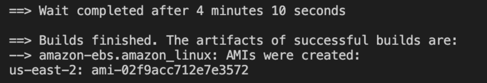
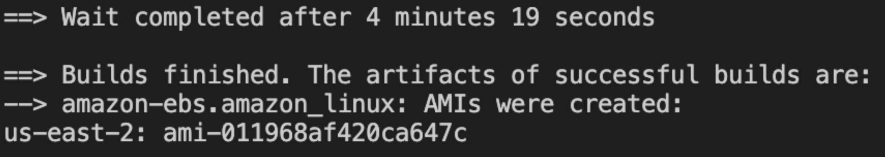
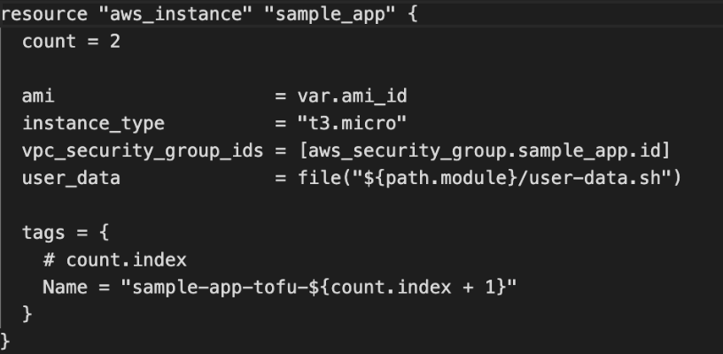
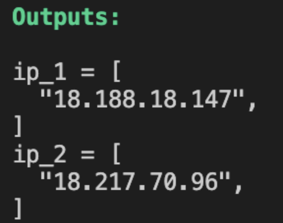
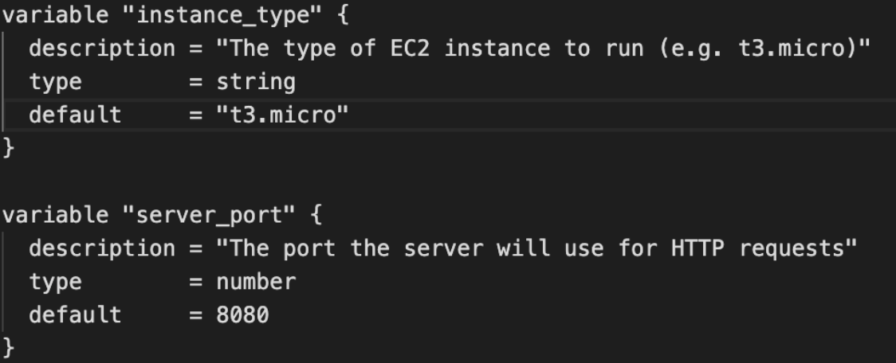
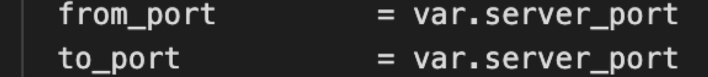
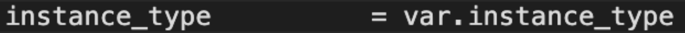
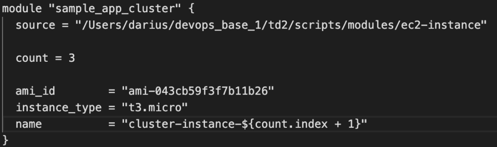
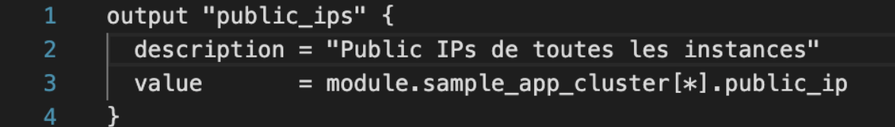
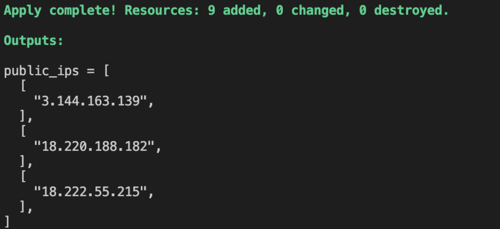

# LAB 2 - Rapport d'Exercices

## Section 1: Authenticating to AWS on the Command Line

**Question 1:** What happens if you run the script a second time? Try it and observe the output. Explain why this happens.

**Reponse:**
Le script relance le processus complet : création d'un nouveau Security Group et lancement d'une nouvelle instance EC2.

```bash
$ ./deploy-ec2-instance.sh
Creating Security Group...
Security Group Created: sg-079a8dfaa976cad70
Launching EC2 Instance...
Instance launched: i-02159002208f9356c
Waiting for instance to be running...
Deployment Complete!
```

**Question 2:** Modify the script to deploy multiple EC2 instances. How would you adjust the script to handle this?

**Réponse** : Il faut ajouter l'option ```--count ``` à la commande aws ec2 run-instances.

```bash
echo "Lancement de l'instance..."
instance_id=$(aws ec2 run-instances \
 --image-id "$AMI_ID" \
 --count 2 \
 --instance-type "t3.micro" \
```

**Question 3:** What happens if you run the configuration playbook a second time? Observe and explain.

```diff
PLAY RECAP **********************************************
!Localhost : ok=4 changed=3 unreachable=0 failed=0 skipped=0
```

**Réponse** : 
Lorsque l’on lance notre commande ```ansible-playbook -v -i inventory.aws_ec2.yml configure_sample_app_playbook.yml```,le script exécute plusieurs tâches la première fois qu’une tâche est validé son “état” change c’est pour cela que à la fin du script on a ```changed = 3``` en jaune. En relançant la même commande, cette fois il n'y a rien qui change niveau état car tout est déjà lancé. (Il saute la création de clés ansible car elle est déjà existante.) C’est un principe nommée Idempotence. (Le fait de ne pas répéter une opération déjà effectué.)

```diff 
PLAY RECAP **********************************************
+ Localhost : ok=3 changed=0 unreachable=0 failed=0 skipped=1
```
**Question 4:** Modify the playbook to deploy and configure multiple EC2 instances. How would you adjust the playbook and inventory?

**Réponse** : 
Il existe plusieurs manières de déployer plusieurs instances, la plus simple et moins optimale serait d’un lancer plusieurs à la suite et ensuite il s’empile jusqu'à en le nombre voulu avec un count.
L’approche la plus méthodique serait de passer par les tags (on colle une étiquette sur chaque instances) pour ensuite les compter et si on veut créer par exemple 2 instances, on crée un exact_count qui prend en compte le tag pour les instances ce qui nous permettrait dès l’initialisation de choisir notre nombre d’instances donc par exemple , on veut deux instances on en a qu’une on en crée une autre mais ce qui diffère de la méthode précédente c’est que si on possède 3 instances il en détruit une pour en avoir seulement deux ce qui est possible car le playbook est un contrôleur d’etat et non simple script. (il supprime le script le plus ancien d’abord.)

```yaml
tags:
  Ansible: ch2_instances
count_tag:
  Ansible: ch2_instances
exact_count: 2
```

Dans l’inventaire , on ne doit rien changer car il est dynamique, il met dans un groupe les machines par tags.



**Question 5:** What happens if you run packer build a second time? Explain why.


**Réponse** : 

Une deuxième instance se lance car la ligne de commande ```ami_name= "sample-app-packer-${uuidv4()} ``` crée une suite de caractères aléatoires et unique à chaque lancement.



**Question 6:** Modify the Packer template to create images for another cloud provider or for
local use (e.g., VirtualBox)


**Question 7:** What happens if you run tofu apply after the resources have been destroyed?
Explain the behavior.


**Réponse** : 
Lorsque l’on lance Open Tofu après que les instances soient détruites, OT compare AWS et main.tf  et remarque qu’il n’existe pas d’instance et va en créer une. Le fichier main.tf exige que l’on crée une instance.

**Question 8:** How would you modify the OpenTofu code to deploy multiple EC2 instances?
Implement this change using a loop or by defining multiple resources.


**Réponse** : 
Même méthode pour OpenTofu on ajoute un compteur et tags pour labelliser le count dans le main pour que l’on lance directement les deux instances.





**Question 9:** Modify the module to accept additional parameters like port and instance_type.Update the root module to pass these parameters.


**Réponse** : 
On cherche donc à arrêter de Hardcoder en mettant directement les valeurs comme “t3.micro” ou “8080” on veut que notre script va chercher les informations directement dans le module.
On doit donc créer des variables que l’on utilisera dans le main.







**Question 10:** Use OpenTofu's count or for_eachto deploy multiple instances without duplicating code in the root module


**Réponse** : 
Même manœuvre que précédemment, on ajoute un count et ensuite on modifie le output pour obtenir les ID de chaque instance.



Au lieu d’avoir plusieurs modules par sample-app, on en a une pour en faire plusieurs.



On modifie bien le output.tf pour afficher toute les IPs (Ps : [*] permet de récupérer chaque ID créé par le module.)

On obtient les IPs




**Question 11:**

On essaye maintenant au lieu d'etre seulement en local, on va desormais chercher dans le Git.

```bash

module "sample_app_cluster" {
  source = "git::https://github.com/Antoine-DaCruzPereira/devops-lab.git/" #on modifira avec le chemin vers variables.tf quand le git sera prêt

  count = 1  

  ami_id        = "ami-043cb59f3f7b11b26"
  instance_type = "t3.micro"
  name          = "cluster-instance-${count.index + 1}"
}
```


**Question 12:**

On va utiliser un module : le Module VPC AWS. Il permet de créer un réseau privé virtuel. Quand on lanceras ```tofu init```, OpenTofu va voir que ce n'est pas  sur la machine local. Il va aller sur Internet, télécharger ce module et le préparer pour qu'on puisse l'utiliser.


```bash
module "vpc" {
  source  = "terraform-aws-modules/vpc/aws"
  version = "5.1.2" 

  name = "VPC_Test"
  cidr = "10.0.0.0/16"

  azs             = ["us-east-2a", "us-east-2b"]
  private_subnets = ["10.0.1.0/24", "10.0.2.0/24"]
  public_subnets  = ["10.0.101.0/24", "10.0.102.0/24"]

  enable_nat_gateway = false 
  enable_vpn_gateway = false

  tags = {
    Terraform   = "true"
    Environment = "dev"
  }
}
```

Source : https://registry.terraform.io/modules/terraform-aws-modules/vpc/aws/latest 

**Conclusion**

Le but de LAB2 est de crée une Infrastructure as Code (Iac) donc la base du devops.

Le LAB 1 nous apprenait à lancer les instances manuellement avec des petits scripts.On utilise Packer pour crée une image qui ne change pas en génerant un AMI(Amazon Machine Image) qui est l'image.

Ensuite avec l'AMI, on peut crée les serveurs grâce à OpenTofu, on passe donc plus par la console AWS.

Ensuite, on rajoute des variables et des count pour demarrer des serveurs identiques.

Pour finir, on passe du local au online.