- Support de cours: [lab3.pdf](./lab3.pdf)


# Compte rendu TD3 - Points de modification et reponses aux exercices

## Recap des modifications a apporter aux scripts (avec raisons)

### 1) Types d'instances `t2.micro` non eligibles
**Probleme rencontre :** sur certains comptes, `t2.micro` n'est pas eligible Free Tier (erreur `InvalidParameterCombination`).  
**Pourquoi changer :** sans un type eligible, la creation EC2 echoue et bloque toutes les etapes.  
**Modification conseillee :** remplacer par `t3.micro` ou un type Free Tier compatible.  
Fichiers impactes:  
- `td3/scripts/ansible/create_ec2_instances_playbook.yml`  
- `td3/scripts/packer/sample-app.pkr.hcl`  
- `td3/scripts/tofu/live/asg-sample/main.tf`  
- modules ASG si besoin via variable `instance_type`

### 2) Cle SSH non creee en local (key pair deja existante)
**Probleme rencontre :** si la key pair existe deja, `amazon.aws.ec2_key` ne recree pas le fichier local, donc SSH echoue (no such identity).  
**Pourquoi changer :** Ansible ne peut pas se connecter aux instances sans la cle privee locale.  
**Modification conseillee :** ecrire la cle avec un chemin absolu et recreer la key pair si besoin.  
Fichiers impactes:  
- `td3/scripts/ansible/create_ec2_instances_playbook.yml` (champ `file_name`)  
- `td3/scripts/ansible/group_vars/*.yml` (chemin absolu pour `ansible_ssh_private_key_file`)

### 3) Desactivation SSH host key checking incorrecte
**Probleme rencontre :** `ansible_host_key_checking: false` n'est pas une variable valide, donc le SSH strict reste actif.  
**Pourquoi changer :** les premieres connexions peuvent echouer si l'hote n'est pas encore dans `known_hosts`.  
**Modification conseillee :** utiliser `ansible_ssh_common_args: "-o StrictHostKeyChecking=no"` ou un `ansible.cfg`.  
Fichiers impactes:  
- `td3/scripts/ansible/group_vars/*.yml`

### 4) Inventory dynamique et `ansible_host`
**Probleme rencontre :** la variable `ansible_host` peut etre vide selon l'inventaire AWS.  
**Pourquoi changer :** Nginx a besoin des IPs des instances backend pour le proxy.  
**Modification conseillee :** ajuster le template Nginx pour utiliser `hostvars[host].public_ip_address` si `ansible_host` est absent.  
Fichier impacte:  
- `td3/scripts/ansible/roles/nginx/templates/nginx.conf.j2`

### 5) User-data ASG (PM2)
**Probleme rencontre :** `sudo su app-user` dans un script non-interactif ne lance pas les commandes suivantes.  
**Pourquoi changer :** PM2 ne demarre pas l'app si la commande n'est pas executee dans le bon contexte.  
**Modification conseillee :** utiliser `sudo su - app-user -c "pm2 start ... && pm2 save"` ou `runuser -l`.  
Fichier impacte:  
- `td3/scripts/tofu/live/asg-sample/user-data.sh`

### 6) Docker buildx multi-arch avec `--load`
**Probleme rencontre :** `docker buildx build --platform=linux/amd64,linux/arm64 --load` ne fonctionne pas (multi-arch + load).  
**Pourquoi changer :** build impossible ou image incomplete localement.  
**Modification conseillee :** utiliser `--push` vers ECR ou limiter a un seul `--platform` pour `--load`.  
Fichier impacte:  
- instructions de la partie Docker/ECR du PDF (commandes)

### 7) Service Kubernetes type LoadBalancer en local
**Probleme rencontre :** sur Docker Desktop, le type `LoadBalancer` ne fournit pas toujours une IP utilisable.  
**Pourquoi changer :** le test `curl http://localhost` peut echouer.  
**Modification conseillee :** utiliser `kubectl port-forward` ou un service `NodePort` pour les tests locaux.  
Fichier impacte:  
- `td3/scripts/kubernetes/sample-app-service.yml` (si tu veux forcer NodePort)

## Reponses aux exercices / questions

### Partie Kubernetes (Practice - ALB)
Pour obtenir un ALB au lieu d'un Classic Load Balancer sur EKS, il faut installer l'AWS Load Balancer Controller (IAM OIDC, policy, helm chart), puis annoter le Service ou utiliser un Ingress avec `kubernetes.io/ingress.class: alb`. L'ALB est alors cree automatiquement et le trafic est route via l'Ingress.

### Scaling du deployment
Modifier `spec.replicas` dans `sample-app-deployment.yml` (par exemple 1, 3, 5) puis appliquer: `kubectl apply -f sample-app-deployment.yml`. On verifie avec `kubectl get pods` et `kubectl rollout status`.

### Test de tolerance aux pannes
Si on termine un worker node EKS, l'ASG gere la remontee en recreant un node. Kubernetes reschedule les pods sur les nodes restants, ce qui peut causer une courte indisponibilite selon les probes, mais le service reste accessible si le nombre de replicas est suffisant.

### Partie Lambda (Practice)
Changer de runtime: modifier `runtime` (ex: `python3.12`) et adapter `index.py`.  
Ajouter des routes: ajouter `POST /data` dans `api_gateway_routes` et redeployer.  
Gestion d'erreurs: retourner des status codes 4xx/5xx dans le handler.  
Integration AWS: ajouter un SDK (S3/DynamoDB) et les permissions IAM dans le module Lambda.

## Deroulement - Partie 1 (Ansible)

### Etape 1 - Verification de l'environnement
Objectif: verifier que la collection `amazon.aws` est bien installee et que l'AWS CLI fonctionne dans WSL avec les bons credentials.

Commandes executees:
```bash
cd /mnt/d/ESIEE/DevOps/td3/scripts/ansible
ansible-galaxy collection list | rg amazon.aws
aws sts get-caller-identity
```

Resultat attendu: la collection `amazon.aws` apparait et la commande AWS retourne l'identite du compte.


### Etape 2 - Creation des EC2 pour l'application
Objectif: creer 3 instances EC2 taguees `Ansible=sample_app_instances` pour heberger l'app Node.js.

Commandes executees:
```bash
cd /mnt/d/ESIEE/DevOps/td3/scripts/ansible
ansible-playbook -v create_ec2_instances_playbook.yml --extra-vars "@sample-app-vars.yml"
```

Verification (instances en running):
```bash
aws ec2 describe-instances \
  --filters "Name=tag:Ansible,Values=sample_app_instances" "Name=instance-state-name,Values=running" \
  --query "Reservations[*].Instances[*].[InstanceId,PublicIpAddress]" \
  --output table
```

Resultat attendu: 3 instances en etat `running` avec une IP publique.


Modification appliquee: `instance_type` force a `t3.micro` dans `td3/scripts/ansible/create_ec2_instances_playbook.yml` pour rester en Free Tier.

Avant:
```
instance_type: t2.micro
```
Apres:
```
instance_type: t3.micro
```

Execution realisee: 3 instances creees avec succes (IDs visibles dans la sortie Ansible).

### Etape 3 - Inventory dynamique et preparation SSH
Objectif: verifier que l'inventaire dynamique recupere bien le groupe `sample_app_instances` et securiser la cle SSH.

Commandes executees:
```bash
cd /mnt/d/ESIEE/DevOps/td3/scripts/ansible
ansible-inventory -i inventory.aws_ec2.yml --graph
ls -l /mnt/d/ESIEE/DevOps/td3/scripts/ansible/ansible-ch3.key
chmod 400 /mnt/d/ESIEE/DevOps/td3/scripts/ansible/ansible-ch3.key
```

Resultat attendu: le groupe `sample_app_instances` contient 3 hotes et la cle SSH est en permissions strictes.

### Etape 4 - Correction permissions de la cle SSH et deploiement de l'app
Objectif: placer la cle privee sur un chemin WSL avec permissions strictes, puis lancer le playbook de configuration.

Commandes executees:
```bash
mkdir -p /home/rayan/.ssh
cp /mnt/d/ESIEE/DevOps/td3/scripts/ansible/ansible-ch3.key /home/rayan/.ssh/ansible-ch3.key
chmod 400 /home/rayan/.ssh/ansible-ch3.key
ansible-playbook -v -i inventory.aws_ec2.yml configure_sample_app_playbook.yml
```

Resultat attendu: le playbook configure Node.js et l'app sur les 3 instances.

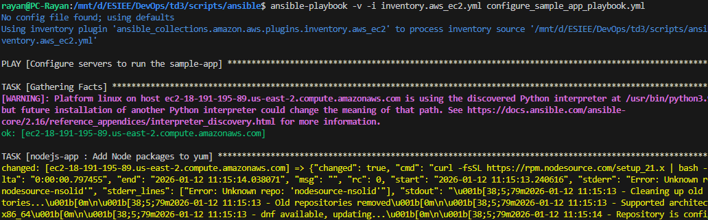 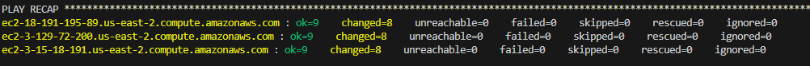

Execution realisee: playbook OK sur les 3 instances (ok=9, changed=8).

### Etape 5 - Verification de l'application sur chaque instance
Objectif: recuperer les IPs publiques et verifier que l'app repond sur le port 8080.

Commandes executees:
```bash
aws ec2 describe-instances \
  --filters "Name=tag:Ansible,Values=sample_app_instances" "Name=instance-state-name,Values=running" \
  --query "Reservations[*].Instances[*].PublicIpAddress" \
  --output text
```

Verification navigateur: ouverture de `http://<IP_PUBLIC>:8080` sur les 3 instances.

Resultat attendu: la reponse "Hello, World!" s'affiche sur chaque IP.

 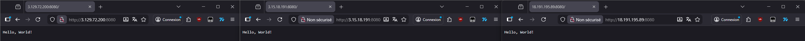
devops-lab\page_quartz\content\labs\td3\screens
### Etape 6 - Creation de l'instance Nginx (load balancer)
Objectif: creer une instance EC2 dediee a Nginx pour faire l'equilibrage de charge.

Commande executee:
```bash
cd /mnt/d/ESIEE/DevOps/td3/scripts/ansible
ansible-playbook -v create_ec2_instances_playbook.yml --extra-vars "@nginx-vars.yml"
```

Resultat attendu: une instance taguee `Ansible=nginx_instances` est creee.

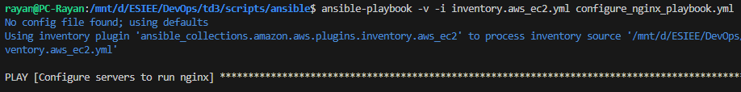 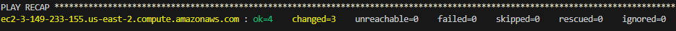

### Etape 7 - Configuration de Nginx et test du load balancer
Objectif: configurer Nginx comme reverse proxy vers les 3 instances applicatives et verifier la reponse HTTP via le LB.

Commandes executees:
```bash
cd /mnt/d/ESIEE/DevOps/td3/scripts/ansible
ansible-playbook -v -i inventory.aws_ec2.yml configure_nginx_playbook.yml
aws ec2 describe-instances \
  --filters "Name=tag:Ansible,Values=nginx_instances" "Name=instance-state-name,Values=running" \
  --query "Reservations[*].Instances[*].PublicIpAddress" \
  --output text
```

Test:
```bash
curl http://<NGINX_PUBLIC_IP>
```

Resultat attendu: la reponse de l'app (Hello, World!) via l'IP du LB.

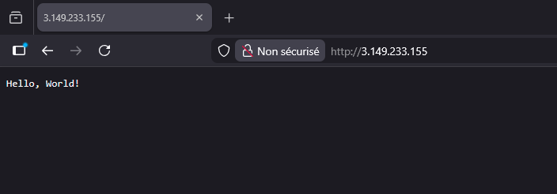 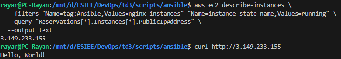

Execution realisee: le LB repond et affiche "Hello, World!".

### Etape 8 - Rolling update (mise a jour progressive)
Objectif: changer le message de l'app et deployer progressivement (1 instance a la fois).

Modification:
- Dans `td3/scripts/ansible/roles/sample-app/files/app.js`, remplacer `Hello, World!` par `DevOps Base!`.

Commandes executees:
```bash
cd /mnt/d/ESIEE/DevOps/td3/scripts/ansible
ansible-playbook -v -i inventory.aws_ec2.yml configure_sample_app_playbook.yml
```

Verification (rolling update via le LB):
```bash
while true; do curl http://<NGINX_PUBLIC_IP>; sleep 1; done
```

Resultat attendu: la reponse passe progressivement a "DevOps Base!".

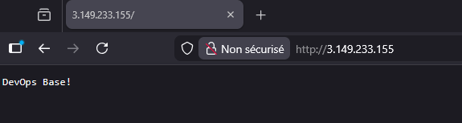

Note (erreur rencontree): j'ai d'abord relance `configure_nginx_playbook.yml`, ce qui ne met pas a jour l'app. Le LB affichait donc encore "Hello, World!". La correction a ete de relancer `configure_sample_app_playbook.yml` pour redeployer l'app sur les instances backend.

Execution realisee: le LB affiche bien "DevOps Base!".

## Deroulement - Partie 2 (Packer + OpenTofu)

### Etape 9 - Build de l'AMI avec Packer
Objectif: construire une AMI preconfiguree avec Node.js, PM2 et l'app sample.

Commandes executees:
```bash
cd /mnt/d/ESIEE/DevOps/td3/scripts/packer
packer init sample-app.pkr.hcl
packer build sample-app.pkr.hcl
```

Probleme rencontre: echec du build car `t2.micro` n'est pas eligible Free Tier.

Correction appliquee (avant/apres):
Avant:
```
instance_type   = "t2.micro"
```
Apres:
```
instance_type   = "t3.micro"
```


Execution realisee: build Packer OK, AMI ID = `ami-0ccb8c9a43391883f`.

Note: un warning `Error: Unknown repo: 'nodesource-nsolid'` est affiche, mais l'installation Node.js et la creation de l'AMI ont reussi.

### Etape 10 - Deploiement ASG avec OpenTofu
Objectif: deployer l'Auto Scaling Group a partir de l'AMI Packer et l'exposer via l'ALB.

Commandes executees:
```bash
cd /mnt/d/ESIEE/DevOps/td3/scripts/tofu/live/asg-sample
tofu init
tofu apply
```

Probleme rencontre: `Unsupported argument` car le module ASG attend `ami_name` et non `ami_id`.

Corrections appliquees (avant/apres):
Avant:
```
ami_id        = "ami-0f5b3d9c244e6026d"
instance_type = "t2.micro"
```
Apres:
```
ami_name      = "sample-app-packer-*"
instance_type = "t3.micro"
```

Probleme rencontre: echec ASG (Access denied) sur le role `AWSServiceRoleForAutoScaling`.  
Correction tentative: activer la creation du service-linked role via `create_service_linked_role = true`.

Avant:
```
target_group_arns = [module.alb.target_group_arn]
```
Apres:
```
target_group_arns = [module.alb.target_group_arn]
create_service_linked_role = true
```

Probleme suivant: la creation du role a echoue car il existait deja ("service role name ... has been taken").  
Correction finale: desactiver la creation explicite (`create_service_linked_role = false`) et reutiliser le role existant.

Verification du role:
```bash
aws iam get-role --role-name AWSServiceRoleForAutoScaling
```

Execution realisee: `tofu apply` OK et sortie `alb_dns_name = "sample-app-alb-1837808816.us-east-2.elb.amazonaws.com"`.

### Etape 11 - Test de l'ALB
Objectif: verifier que l'app repond via l'ALB.

Commande executee:
```bash
curl http://sample-app-alb-1837808816.us-east-2.elb.amazonaws.com
```

Resultat observe: reponse `Hello, World!` (version de l'app integree dans l'AMI Packer).

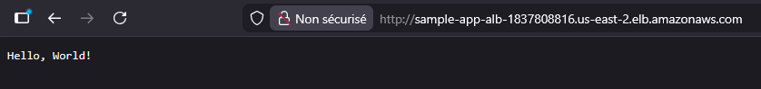

### Etape 12 - Nouvelle AMI + rolling update ASG
Objectif: reconstruire l'AMI avec le message "DevOps Base!" et declencher une mise a jour progressive via l'ASG.

Commandes executees:
```bash
cd /mnt/d/ESIEE/DevOps/td3/scripts/packer
packer build sample-app.pkr.hcl
```

Resultat: nouvelle AMI `ami-0fecf56fc95a63785`.

Puis:
```bash
cd /mnt/d/ESIEE/DevOps/td3/scripts/tofu/live/asg-sample
tofu apply
```

Verification (rolling update via ALB):
```bash
while true; do curl http://sample-app-alb-1837808816.us-east-2.elb.amazonaws.com; sleep 1; done
```

Resultat observe: alternance "Hello, World!" puis "DevOps Base!" pendant le refresh, puis stabilisation sur "DevOps Base!".

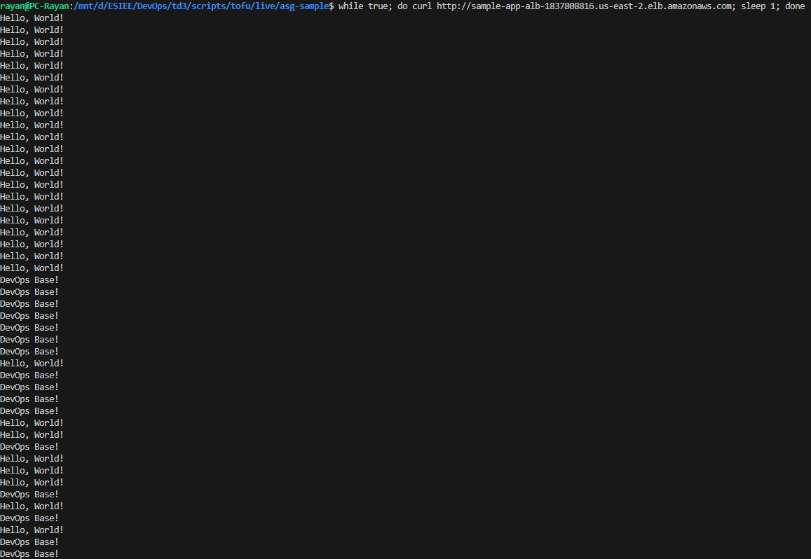

## Deroulement - Partie 3 (Docker + Kubernetes local)

### Etape 13 - Verification Docker et contexte
Objectif: verifier que Docker est accessible depuis WSL avant de builder l'image.

Commandes a executer:
```bash
docker version
```

Probleme rencontre: `docker` introuvable dans WSL (integration Docker Desktop desactivee).

Correction:
- Ouvrir Docker Desktop sur Windows.
- Settings > Resources > WSL Integration.
- Activer l'integration pour la distribution WSL utilisee (ex: Ubuntu).
- Redemarrer Docker Desktop.
- Relancer `docker version` dans WSL.

Probleme rencontre: `permission denied` sur `/var/run/docker.sock`.

Correction:
- Ajouter l'utilisateur au groupe docker: `sudo usermod -aG docker $USER`
- Fermer la session WSL puis se reconnecter.
- Relancer `docker version`.

Resultat attendu: le client et le serveur Docker repondent.

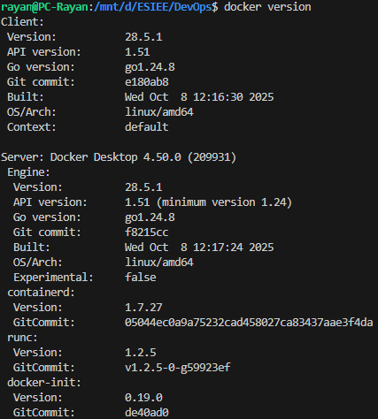

Execution realisee: `docker version` OK (client + serveur).

### Etape 14 - Build et execution du conteneur Docker (local)
Objectif: builder l'image Docker de l'app et verifier qu'elle repond localement.

Commandes executees:
```bash
cd /mnt/d/ESIEE/DevOps/td3/scripts/docker
docker build -t sample-app:v1 .
docker run -p 8080:8080 --name sample-app --rm sample-app:v1
```

Test:
```bash
curl http://localhost:8080
```

Resultat observe: reponse `Hello, World!`.

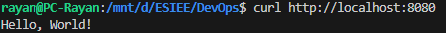

### Etape 15 - Deploiement Kubernetes local
Objectif: deployer l'app dans le cluster Kubernetes local (Docker Desktop).

Commandes executees:
```bash
cd /mnt/d/ESIEE/DevOps/td3/scripts/kubernetes
kubectl apply -f sample-app-deployment.yml
```

Probleme rencontre: `failed to download openapi` (kubectl non connecte au cluster).

Correction:
- Activer Kubernetes dans Docker Desktop (Settings > Kubernetes).
- Premier demarrage: installation du cluster local necessaire pour generer le kubeconfig.
- Verifier le contexte: `kubectl config get-contexts` puis `kubectl config use-context docker-desktop`.
- Si besoin, copier le kubeconfig Windows vers WSL:
  `cp /mnt/c/Users/<WindowsUser>/.kube/config ~/.kube/config`
  (remplacer `<WindowsUser>` par le bon nom, ex: `rayan`)

Puis:
```bash
kubectl apply -f sample-app-deployment.yml
kubectl get pods
kubectl apply -f sample-app-service.yml
curl http://localhost
```

Resultat attendu: pods en running et reponse HTTP OK.

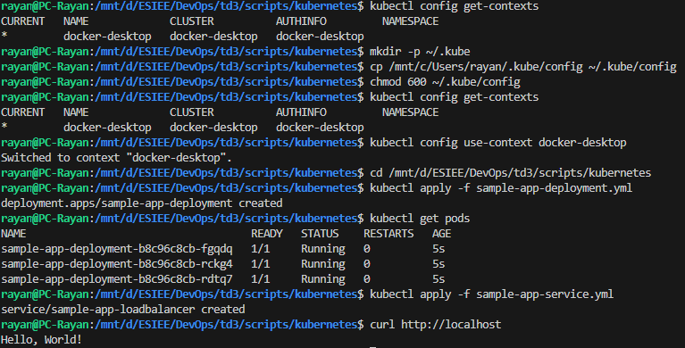

Execution realisee: deployment et service OK, `curl http://localhost` retourne `Hello, World!`.

### Etape 16 - Rolling update Kubernetes (v2)
Objectif: mettre a jour l'image Docker et observer le rollout.

Probleme rencontre: `kubectl apply` indique "unchanged" car le deployment pointait encore vers `sample-app:v1`.

Correction appliquee (avant/apres):
Avant:
```
image: sample-app:v1
```
Apres:
```
image: sample-app:v2
```

Commandes executees:
```bash
cd /mnt/d/ESIEE/DevOps/td3/scripts/kubernetes
kubectl apply -f sample-app-deployment.yml
kubectl rollout status deployment/sample-app-deployment
curl http://localhost
```

Resultat observe: la reponse passe a `DevOps Base!`.

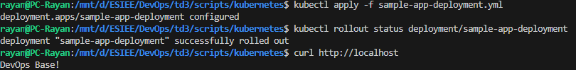

Execution realisee: `curl http://localhost` retourne `DevOps Base!`.
