# Compte rendu TD4

> Lab 4 – Version Control, Build Systems, and Automated Testing

## Section 1 – Version Control with Git

Dans cette première partie, nous avons pris en main un environnement Git depuis la machine locale :

- Tout d'abord, nous avons configuré Git avec la commande `git config --global`.
- Ensuite, nous avons créé le répertoire de travail `/tmp/git-practice` et le fichier `example.txt` que nous utiliserons pour la suite de ce laboratoire.
- Nous avons initialisé le dépôt local avec `git init`, vérifié son état avec `git status`, puis ajouté et effectué le premier commit du fichier `example.txt`.
- Par la suite, nous avons modifié le fichier et visualisé les changements avec `git diff`.
- Nous avons ensuite créé une branche nommée `testing`, modifié `example.txt`, effectué un commit sur cette nouvelle branche, puis l'avons fusionnée dans la branche `main` avec `git merge testing`.

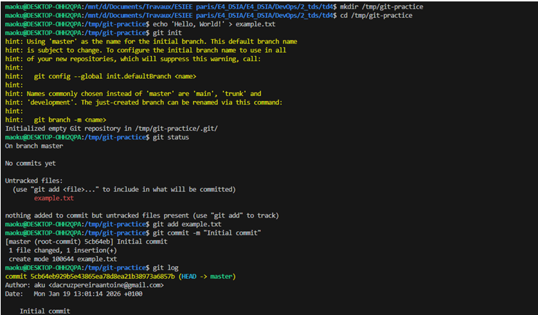 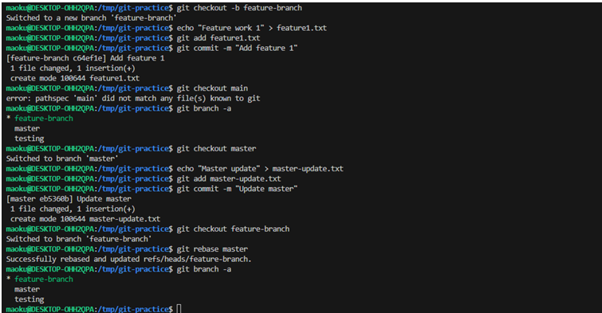 

---

## Section 2 – Collaborating with GitHub

Dans cette deuxième section, nous avons exploré un flux de travail collaboratif en utilisant GitHub :

- Nous avons commencé par créer un dépôt distant sur GitHub, nommé `devops-lab`.
- Ensuite, nous avons ajouté ce dépôt distant comme `origin` à notre dépôt local et avons poussé la branche `main` vers GitHub.
- Une modification a été effectuée directement via l'interface de GitHub, puis récupérée en local grâce à `git pull`.
- Nous avons créé une nouvelle branche, `update-readme`, y avons ajouté un fichier `README.md`, puis l'avons poussée sur GitHub.
- Pour finir, nous avons ouvert une pull request, examiné les modifications, fusionné la branche dans `main` et mis à jour notre copie locale.

Pour cette section, un petit problème c'est glissé, la branche de travail principal du dépôt local au dépôt sur Github ce nomme finalement master et la fusion avec main a été impossible, j'ai donc continué de travailler sur master.

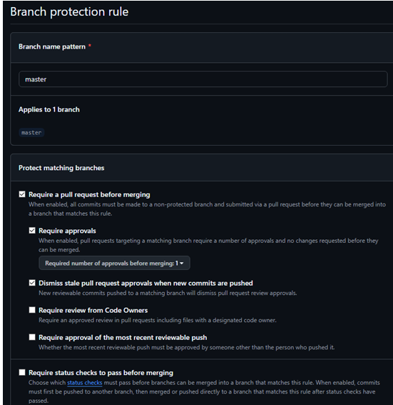  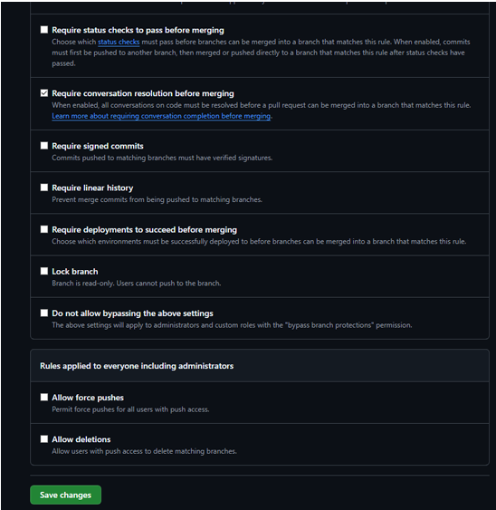 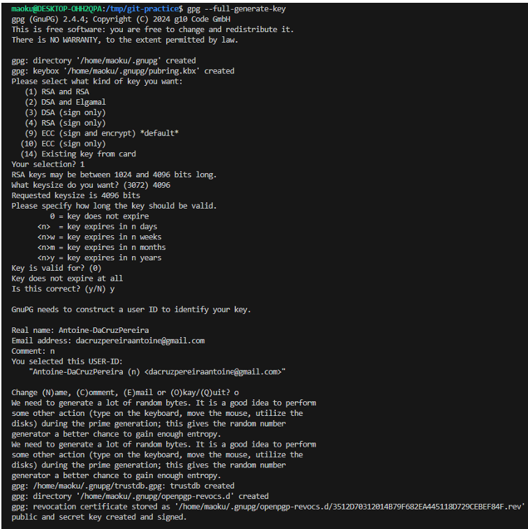 
---

## Section 3 – Setting Up a Build System with NPM

Cette partie était consacrée à la mise en place d'un système de build avec NPM pour une application Node.js :

- Nous avons créé un répertoire `td4/scripts/sample-app` et y avons placé un fichier `app.js` contenant un serveur HTTP simple renvoyant `"Hello, World!"`.
- Le projet a été initialisé avec `npm init -y`, générant un fichier `package.json` par défaut.
- Un script `"start": "node app.js"` a été ajouté au `package.json` pour démarrer l'application avec `npm start`.
- Nous avons rédigé un `Dockerfile` basé sur l'image `node:21.7` pour conteneuriser l'application, en exécutant `npm start`.
- Un script `build-docker-image.sh` a été créé pour construire l'image Docker avec `docker buildx build`, et un script `"dockerize"` a été ajouté au `package.json`.
- L'image Docker a finalement été construite en utilisant `npm run dockerize`.

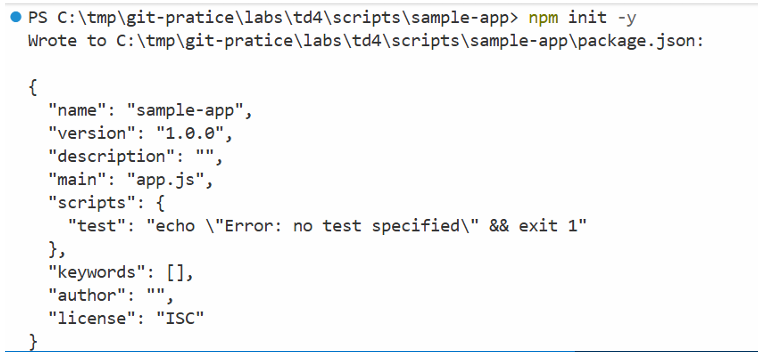 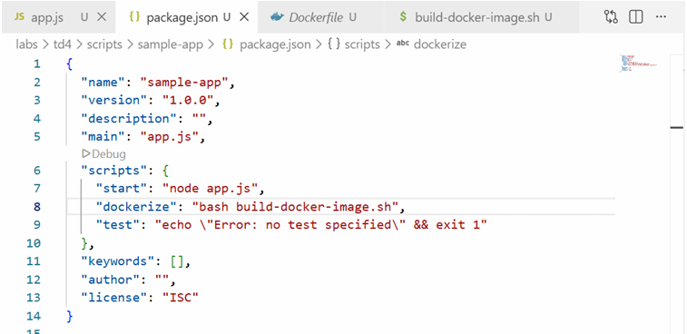 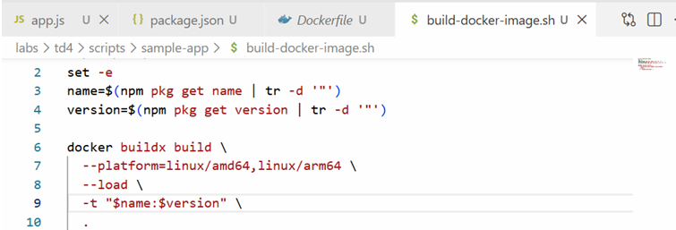 

En réponse à l'une des questions de l'exercice, il est crucial d'épingler les versions des dépendances pour plusieurs raisons :
- **Reproductibilité** : Garantit que les builds sont identiques à chaque fois, quel que soit l'environnement.
- **Stabilité** : Prévient les modifications cassantes (breaking changes) qui pourraient être introduites par des mises à jour inattendues.
- **Sécurité** : Permet un contrôle précis des mises à jour et des correctifs de sécurité appliqués.s mises à jour

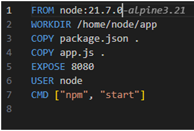 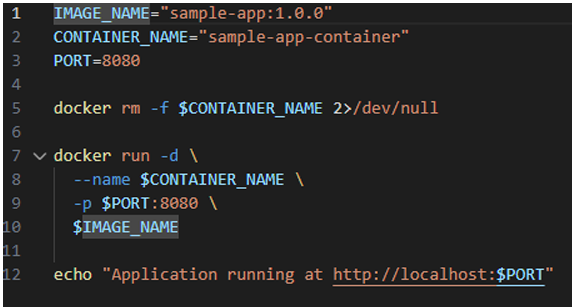

Documentation d'utilisation : 

- **1. Rendre le script exécutable**

`chmod +x run-docker.sh`
- **2. Construire l'image (si pas déjà fait)**

`npm run dockerize`
- **3. Lancer le conteneur**

`npm run docker:run`
- **4. Accéder à l'application**

`curl http://localhost:8080`
- **Voir les logs**

`docker logs sample-app-container`
- **Arrêter le conteneur**

`docker stop sample-app-container`
- **Supprimer le conteneur**

`docker rm sample-app-container`

---

## Section 4 – Managing Dependencies with NPM

Après la mise en place du système de build, nous nous sommes concentrés sur la gestion des dépendances de l'application :

- Nous avons installé Express avec `npm install express --save`, ce qui a ajouté le paquet à la section `dependencies` du `package.json`.
- Le fichier `app.js` a été réécrit pour utiliser Express, avec une route GET `/` renvoyant `"Hello, World!"`.
- Le `Dockerfile` a été mis à jour pour copier `package.json` et `package-lock.json`, puis installer les dépendances avec `npm ci --only=production` avant de copier le reste du code.
- L'image a été reconstruite avec `npm run dockerize`, puis l'application a été démarrée et testée.

 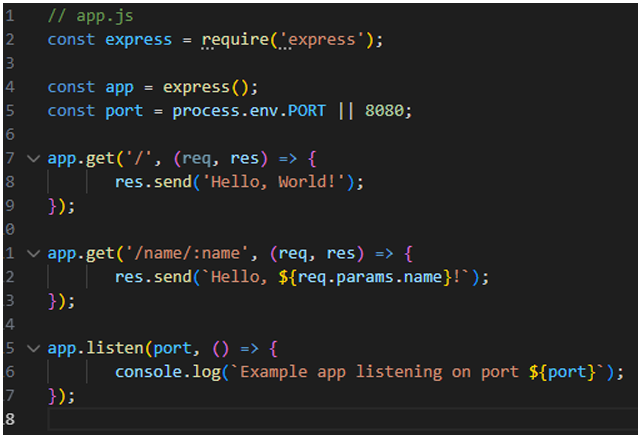 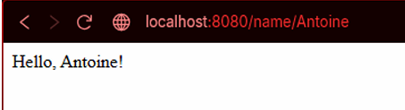 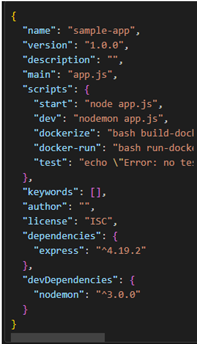

### Exercise 8 :

Les dependencies sont les paquets indispensables au bon fonctionnement de l'application en production.

À l'inverse, les devDependencies sont des outils utilisés uniquement durant la phase de développement. Pour les installer, nous utilisons l'option --save-dev, par exemple : npm install jest --save-dev.

Cette séparation est fondamentale pour plusieurs raisons. Premièrement, elle permet de créer des images Docker plus légères et sécurisées pour la production, car la commande npm ci --only=production n'installe que les dependencies nécessaires. Cela réduit la surface d'attaque en limitant le nombre de paquets et de vulnérabilités potentielles dans l'environnement de production. Enfin, des images plus petites se traduisent par des déploiements plus rapides et une meilleure performance globale.

---

## Section 5 – Automated Testing

Dans cette section, nous avons intégré des tests automatisés à notre application Node.js en utilisant Jest et SuperTest :

- Les dépendances de test ont été installées avec `npm install --save-dev jest supertest`, et un script `"test": "jest --verbose"` a été ajouté au `package.json`.
- L'application a été restructurée en séparant `app.js` (exportant l'instance Express) de `server.js` (démarrant le serveur).
- Un fichier de test `app.test.js` a été créé pour valider les routes `/` et `/name/:name`, en vérifiant le code de statut HTTP et le corps de la réponse.
- Les tests ont été exécutés avec `npm test` pour confirmer leur succès.
- Nous avons simulé une régression en modifiant la réponse d'une route, observé l'échec des tests, puis corrigé le code pour les faire passer à nouveau.

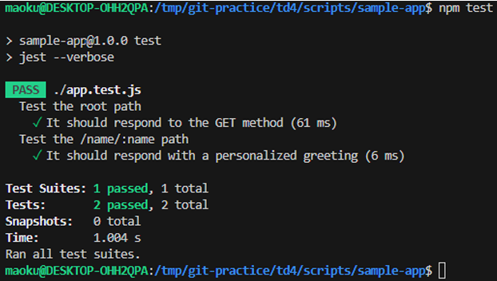 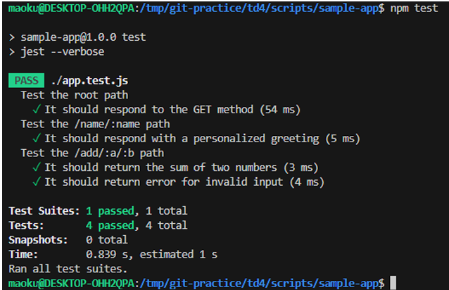 

### Exercise 10 : 

Le code coverqge analysis est une pratique essentielle qui permet d'identifier les parties du code non testées, ce qui est crucial pour améliorer la qualité globale du logiciel et réduire les bugs en production. Elle apporte également une confiance accrue aux développeurs lors de modifications, en s'assurant que les changements n'introduisent pas de régressions. Enfin, les tests eux-mêmes agissent comme une forme de documentation vivante, illustrant le fonctionnement attendu du code.

---

## Section 6 – Automated Testing for OpenTofu Code

Ici, nous avons appliqué les principes des tests automatisés à du code d'infrastructure OpenTofu :

- Une structure de dossiers a été créée pour les tests, incluant `td4/scripts/tofu/live` et `td4/scripts/tofu/modules/test-endpoint`.
- Un module `test-endpoint` a été développé pour appeler un endpoint HTTP et exposer son code de statut et son corps de réponse.
- Un fichier de test `deploy.tftest.hcl` a été ajouté, contenant deux étapes :
  - `run "deploy"` pour déployer l'infrastructure et récupérer l'URL de l'API.
  - `run "validate"` pour appeler l'endpoint et vérifier que la réponse est conforme aux attentes (code 200, corps `"Hello, World!"`).
- Les tests ont été lancés avec `tofu test`, qui a automatiquement déployé, validé, puis détruit l'infrastructure.

### Voici la réponse aux `exrcice 11 et 12`

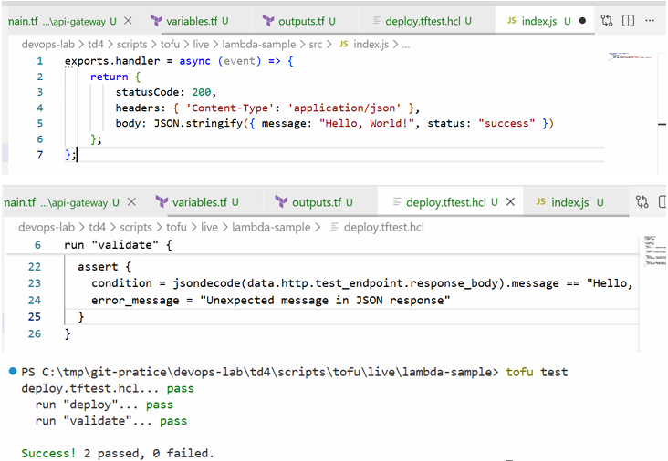 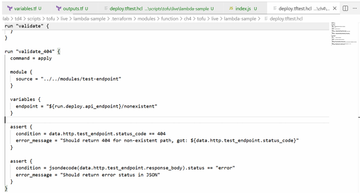 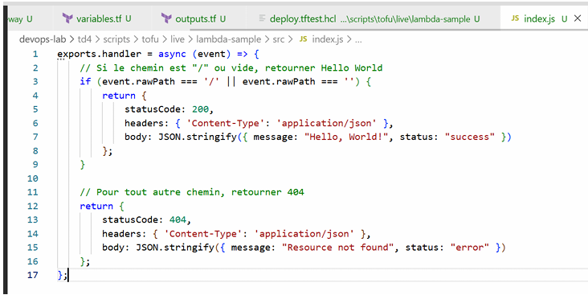 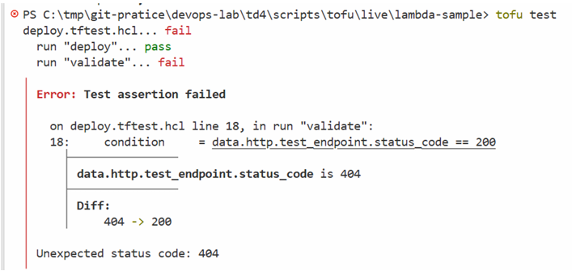
---

## Section 7 – Testing Recommendations

La dernière section, plus théorique, portait sur les bonnes pratiques en matière de tests :

- The Test Pyramid : un grand nombre de tests unitaires, moins de tests d'intégration, et quelques tests de bout en bout.
- La priorisation des tests : se concentrer sur les fonctionnalités critiques, les cas limites et les chemins à fort impact.
- L'approche TDD (Test-Driven Development) : écrire les tests avant le code pour garantir une meilleure conception et une couverture complète.

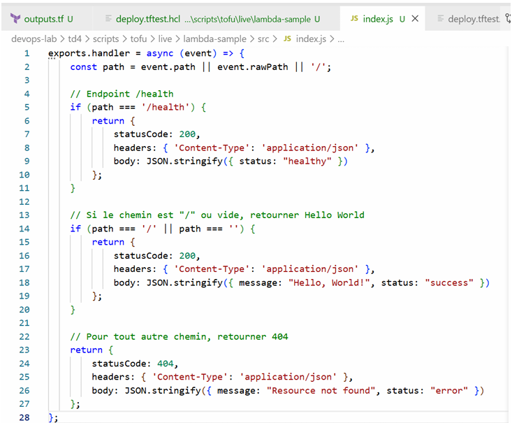 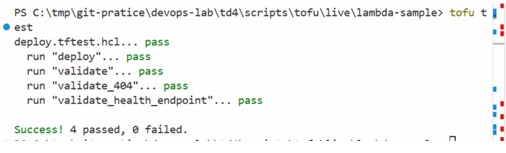

---