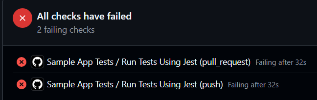
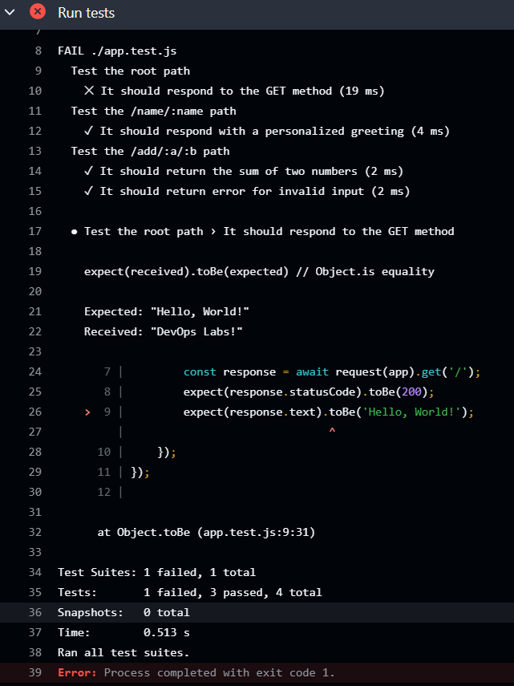
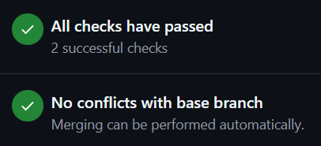
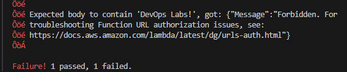
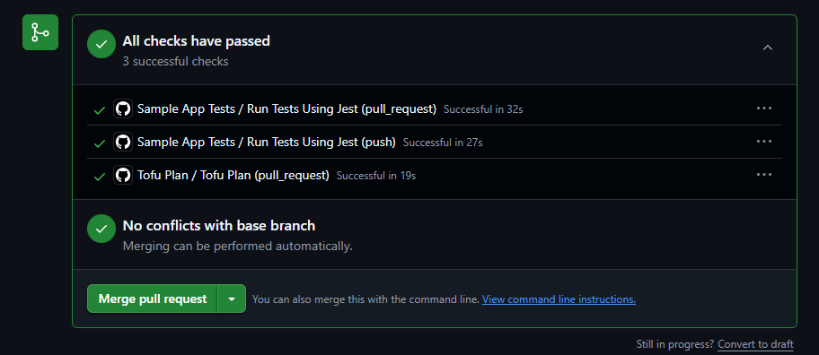
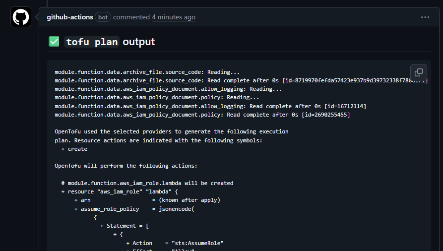
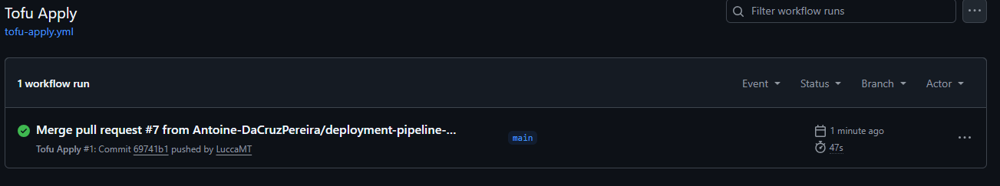
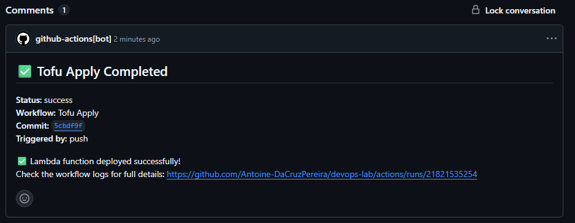

# Compte rendu TD5 - CI/CD avec GitHub Actions et OpenTofu

- Support de cours: [lab5.pdf](./lab5.pdf)

## Introduction

Ce TD traite de la mise en place de pipelines CI/CD avec GitHub Actions. L'objectif est de construire une infrastructure sécurisée sur AWS et d'effectuer des tests en utilisant OpenTofu et de piloter les déploiements via GitHub Actions avec OIDC.

## Partie 1 : Continuous Integration (CI)

### 1.1 - Workflow GitHub Actions avec erreur intentionnelle
Objectif : Créer un workflow de tests automatisés et vérifier qu'il détecte les erreurs.

Workflow créé dans `.github/workflows/app-tests.yml` :
```yaml
name: Application Tests
on: [push, pull_request]
jobs:
  test:
    runs-on: ubuntu-latest
    steps:
      - uses: actions/checkout@v4
      - uses: actions/setup-node@v4
        with:
          node-version: '20'
      - run: npm ci
        working-directory: labs/td5/scripts/sample-app
      - run: npm test
        working-directory: labs/td5/scripts/sample-app
```

Modification dans `app.js` pour provoquer un échec intentionnel :
```javascript
res.send('DevOps Labs!');
// Au lieu de "Hello, World!"
```

Résultat attendu : le Workflow échoue.





En modifiant la réponse de `app.js`, nous avons pu vérifier que le workflow détecte bien l'échec. Cela montre l'efficacité de la CI.

### 1.2 - Correction et validation des tests
Objectif : Corriger l'erreur et vérifier que les tests passent.

Correction appliquée à `app.js` :
```javascript
res.send('Hello, World!');
```

Résultat attendu : Workflow réussi.



Après avoir corrigé le code pour qu'il soit synchronisé avec le test, le pipeline est passé vert et montre bien que le test a été validé.

### 1.3 - Configuration OIDC et rôles IAM pour AWS
Objectif : Mettre en place une authentification sécurisée entre GitHub Actions et AWS via OpenID Connect (OIDC), permettant aux workflows d'accéder aux ressources AWS sans avoir à stocker de credentials statiques dans les secrets GitHub.

Pour éviter l'usage de credentials statques risqués, nous avons configuré OpenID Connect. Nous avoins déployé un Identity Provider dans AWS qui établit une relation de confiance avec GitHub. Ensuite, nous avons utilisé un module Terraform (`github-aws-oidc`) pour créer trois rôles IAM spécifiques (tests, `plan` et `apply`) et définir leurs permissions afin de sécuriser correctementt la pipeline.

Configuration réalisée :
- Déploiement d'un provider OIDC dans AWS pour établir la confiance avec GitHub Actions
- ARN créé : `arn:aws:iam::741989611871:oidc-provider/token.actions.githubusercontent.com`

Rôles IAM créés :
- `lambda-sample-tests` : permissions création/suppression Lambda pour tests
- `lambda-sample-plan` : lecture seule pour planification
- `lambda-sample-apply` : permissions complètes pour déploiement

**Configuration des modules utilisés :**

Module provider OIDC :
```hcl
module "oidc_provider" {
  source  = "brikis98/devops/book//modules/github-aws-oidc"
  version = "1.0.0"

  provider_url = "https://token.actions.githubusercontent.com"
}
```

Module rôles IAM pour GitHub Actions :
```hcl
module "iam_roles" {
  source  = "brikis98/devops/book//modules/gh-actions-iam-roles"
  version = "1.0.0"

  name              = "lambda-sample"                           
  oidc_provider_arn = module.oidc_provider.oidc_provider_arn    

  enable_iam_role_for_testing = true                            

  # TODO: fill in your own repo name here!
  github_repo      = "Antoine-DaCruzPereira/devops-lab" 
  lambda_base_name = "lambda-sample"                            

  enable_iam_role_for_plan  = true                                
  enable_iam_role_for_apply = true                                

  # TODO: fill in your own bucket and table name here!
  tofu_state_bucket         = "devops-lab-tofu-state" 
  tofu_state_dynamodb_table = "devops-lab-tofu-state" 
}
```

Enfin, nous déployons l'infrastrucure :
```hcl
tofu init
tofu apply
```

### 1.4 - Tests d'infrastructure (échec)
Objectif : Configurer un workflow GitHub Actions pour exécuter des tests Opentofu via l'authentification OIDC

Cet étape consistait à automatiser l'exécution de `tofu test`. Cependant, nous avons pas réussi à le réaliser. Le problème rencontré est détaillé dans le récapitulatif final.

Pour cet exercice, le Workflow a bien été créé pour `tofu test` avec authentification OIDC.

Problème : Forbidden sur Function URL

Résultat : échec de l'exercice, pas de test vérifié.



---

## Partie 2 : Continuous Delivery (CD)

Le CD (Déploiement Continu) consiste à automatiser l'intégralité du processus de déploiement. L'idée est de rendre les déploiements à la fois rapides et fiables, de façon fréquente.

### 2.1 - Configuration d'un Backend distant pour OpenTofu state

Objectif : Centraliser l'état OpenTofu sur S3 avec verrou DynamoDB pour la collaboration.

Pour cette partie, nous avons configuré un backend distant afin de centraliser le fichier state d'OpenTofu. Pour y arriver, nous avons utilisé un module pour créer un bucket S3, dédié au stockage du fichier; et une table DynamoDB qui verrouille l'état lors des modifications pour éviter les conflits entre utilisateurs.
Une fois déployées,  nous avons migré notre état local vers AWS avec la commande `tofu init`. 

---

Module déployé :
```hcl
module "state" {
  source  = "brikis98/devops/book//modules/state-bucket"
  version = "1.0.0"
  name    = "devops-lab-tofu-state"
}
```

Ressources créées :
- S3 Bucket : `devops-lab-tofu-state` (versioning + encryption)
- DynamoDB Table : `devops-lab-tofu-state` (lock)

Configuration backend dans `backend.tf` :
```hcl
terraform {
  backend "s3" {
    bucket         = "devops-lab-tofu-state"
    key            = "td5/scripts/tofu/live/tofu-state"
    region         = "us-east-2"
    encrypt        = true
    dynamodb_table = "devops-lab-tofu-state"
  }
}
```

**Note :** Le bloc `terraform` est conservé dans la configuration car OpenTofu maintient la compatibilité avec la syntaxe Terraform pour les backends.

Migration réalisée : Import ressources existantes puis migration state vers S3.


### 2.2 - Création des rôles IAM
Objectif : Récupérer les ARNs des rôles pour les workflows GitHub Actions.

Nous avons d'abord modifié le module `ci-cd-permissions` afin d'autoriser la création des rôles IAM pour `plan` et `apply`. Ensuite, nous avons ajouté les ARN créés des nouveaux rôles dans `ci-cd-permissions/output.tf`.

Outputs ajoutés dans `ci-cd-permissions/outputs.tf` :
- `lambda_deploy_plan_role_arn` : `arn:aws:iam::741989611871:role/lambda-sample-plan`
- `lambda_deploy_apply_role_arn` : `arn:aws:iam::741989611871:role/lambda-sample-apply`

### 2.3 - Lancement du Workflow GitHub Actions pour déploiement

Objectif : Automatiser `plan` et `apply` avec séparation des permissions.

Nous avons séparé le déploiement en deux phases distinctes :
1. Tofu Plan : Se déclenche sur chaque Pull Request. Le bot commente directement la PR pour afficher l'aperçu des changements.

2. Tofu Apply : Se déclenche uniquement après la fusion sur la branche `main`. Le workflow applique les modifications et confirme le succès. 

---

Configuration Lambda (`main.tf`) :
```hcl
module "function" {
  source  = "brikis98/devops/book//modules/lambda"
  version = "1.0.0"
  name    = var.name
  src_dir = "${path.module}/src"
  runtime = "nodejs20.x"
  handler = "index.handler"
  memory_size = 128
  timeout = 5
}
```

Workflow Tofu Plan (`.github/workflows/tofu-plan.yml`) :
- Déclenchement : PR vers `main` sur `td5/scripts/tofu/live/lambda-sample/**`
- Authentification : OIDC avec role `lambda-sample-plan`
- Actions : `tofu init` + `tofu plan`
- Résultat : Commentaire automatique sur la PR

Workflow Tofu Apply (`.github/workflows/tofu-apply.yml`) :
- Déclenchement : Push vers `main` sur `td5/scripts/tofu/live/lambda-sample/**`
- Authentification : OIDC avec role `lambda-sample-apply`
- Actions : `tofu init` + `tofu apply -auto-approve`
- Résultat : Commentaire automatique sur le commit


### Étape 2.4 - Test du pipeline complet
Objectif : Vérifier le fonctionnement end-to-end du pipeline CI/CD.

Validation du workflow :

Nous avons testé la pipeline en modifiant le texte de retour de la Lambda dans `src/index.js`. Le cycle complet s'est déroulé avec sucès.

---

Branche créée : `deployment-pipeline-test`

Modification de `lambda-sample`, ajout de `src/index.js`:

```hcl
exports.handler = (event, context, callback) => { 
  callback(null, {statusCode: 200, body: "DevOps Labs!"}); 
}; 
// Au lieu de "Fundamentals of DevOps!"
```


Pull Request créée vers `main` :
- Workflows exécutés : Application Tests ✅, Tofu Plan ✅



- Commentaire bot : 



Merge vers `main` :
- Workflow Tofu Apply déclenché automatiquement
- Résultat : `Apply completed`✅
- Lambda `lambda-sample` déployée avec succès
- State stocké dans S3



- Commentaire bot :



## Récapitulatif des points clés et problèmes rencontrés

### 1) Fichiers OpenTofu commités dans Git (.terraform/)
**Problème rencontré :** Binaires de providers (483 MB) dans `.terraform/` bloqués par GitHub (limite 100 MB).  
**Pourquoi corriger :** Push impossible, historique Git pollué.  
**Solution :** Création `.gitignore`, nouvelle branche propre, récupération sélective des fichiers.  

**Note :** OpenTofu utilise le même dossier `.terraform/` que Terraform pour des raisons de compatibilité.

### 2) Désynchronisation d'état OpenTofu
**Problème rencontré :** Erreurs AssumeRole et "resource already exists" après création nouvelle branche.  
**Pourquoi corriger :** OpenTofu ne voit plus les ressources AWS existantes.  
**Solution :** Récupération `terraform.tfstate` depuis branche originale, ré-import ressources.

### 3) Sources modules incorrectes
**Problème rencontré :** URLs GitHub directes au lieu du Terraform Registry.  
**Pourquoi corriger :** Erreur "subdir not found".  
**Solution :** Migration vers `source = "brikis98/devops/book//modules/lambda"` avec version.

### 4) Permissions Lambda Function URL (non résolu)
**Problème rencontré :** Tests retournent 403 Forbidden malgré `authorization_type = "NONE"`.  
**Tentatives :** `lambda:InvokeFunctionUrl`, `lambda:InvokeFunction`, `time_sleep` pour propagation.  
**Résultat :** Erreur de la section 1.6, solution non trouvée.

### **Points réalisés :**
- ✅ Workflows GitHub Actions pour tests automatisés
- ✅ Authentification AWS via OIDC (sans credentials statiques)
- ✅ Backend distant S3 + DynamoDB pour OpenTofu state
- ✅ Séparation des permissions IAM (plan vs apply)
- ✅ Pipeline CI/CD complète avec déploiement automatisé Lambda
- ✅ Tests d'application automatisés avec Jest
- ❌ Tests d'infrastructure avec Function URL (problème de permissions non résolu)

### **Points d'amélioration :**
- Résoudre le problème permissions Lambda Function URL
- Stocker les ARNs dans GitHub Secrets au lieu de les coder en dur
- Ajouter des tests d'intégration post-déploiement

## Conclusion

Ce TD nous a permis de mettre en pratique les concepts CI/CD avec GitHub Actions et OpenTofu. L'infrastructure est désormais gérée, testée et déployée automatiquement via notre pipeline. Malgré les difficultés rencontrées sur les permissions des Function URLs (section 1.6), notre pipeline de déploiement (CD) est pleinement opérationnel et sécurisé.

