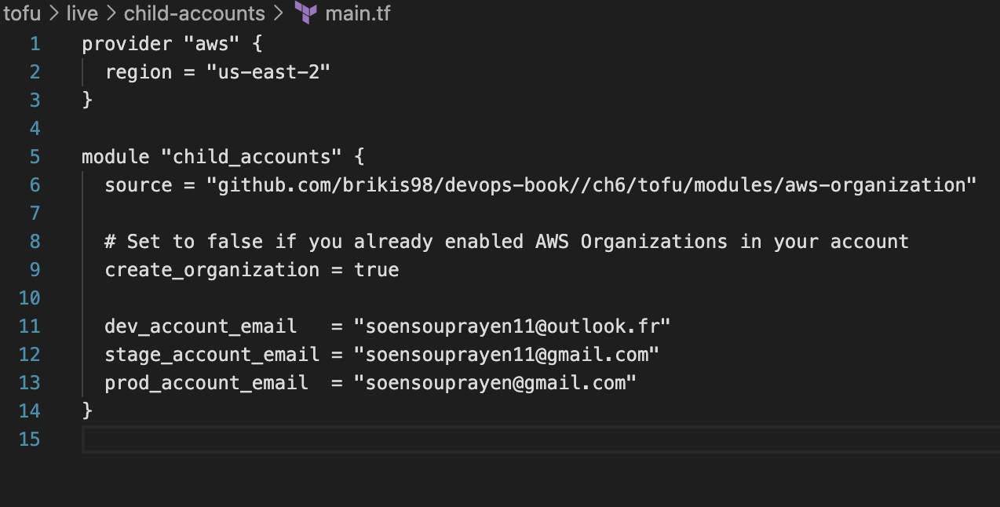
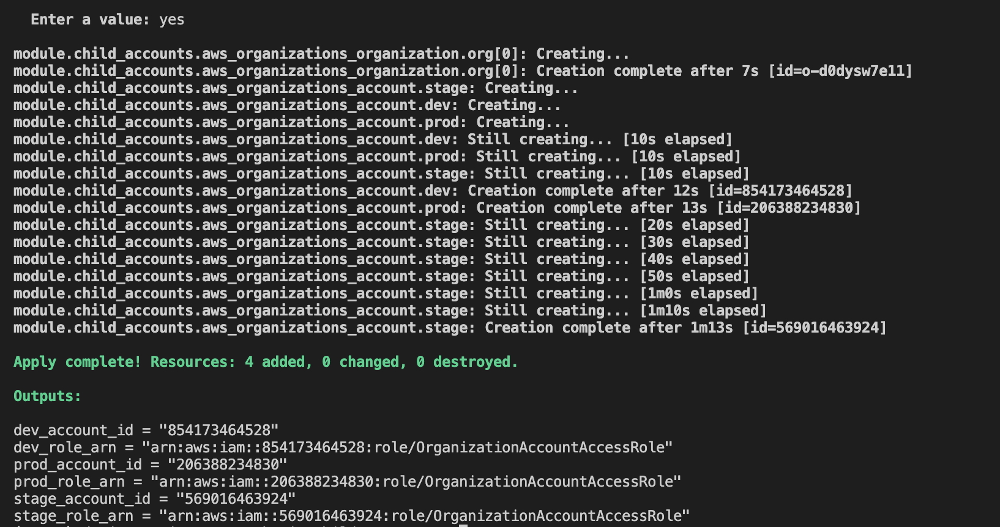
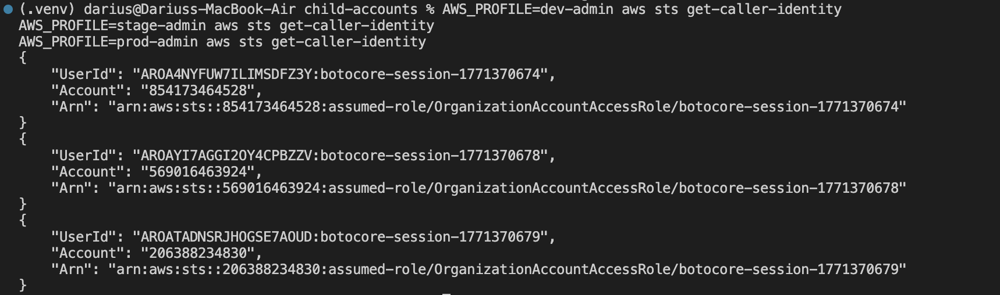
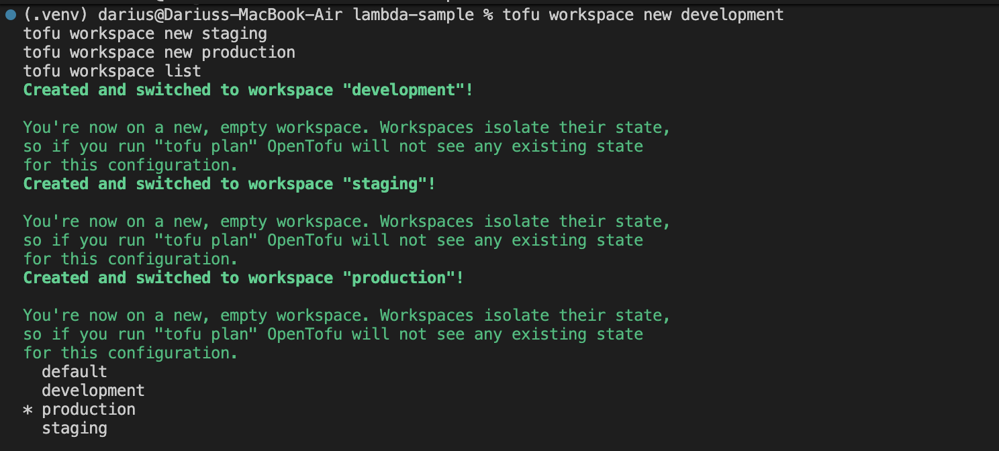
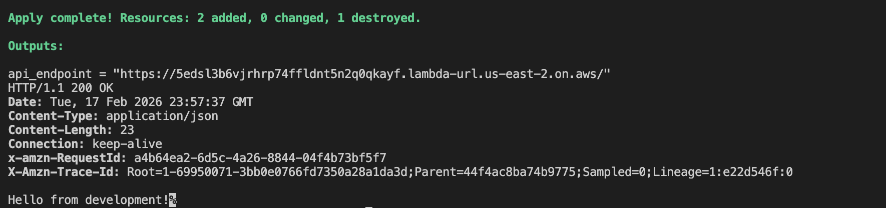
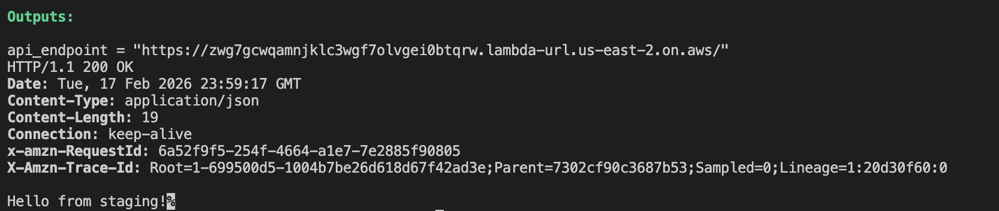
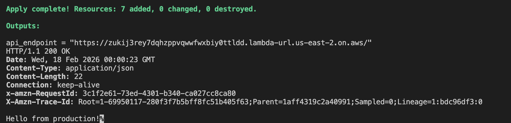
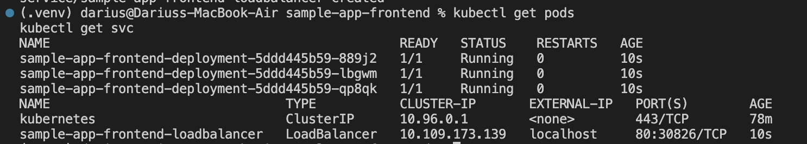
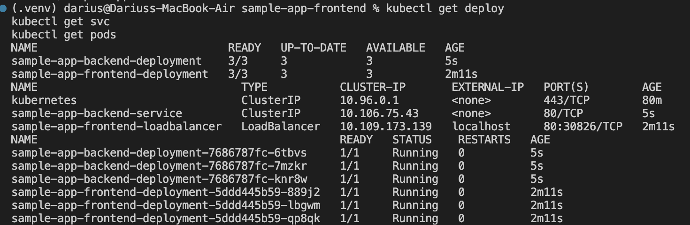
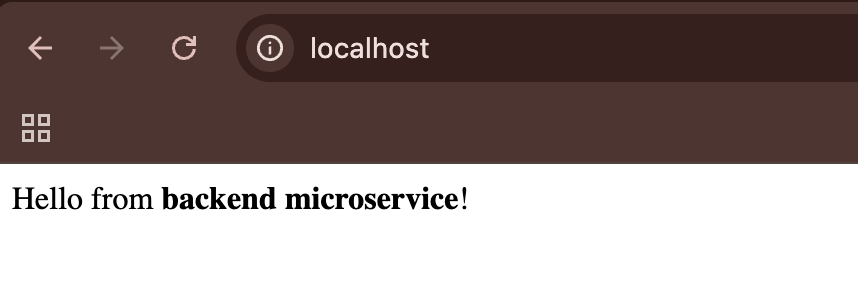

# Lab 6 — Infrastructure Cloud & Microservices

- Support de cours: [lab6.pdf](./lab1.pdf)

##  Objectif du Lab

Ce lab avait pour objectif de mettre en place une architecture cloud :

- La gestion multi-comptes AWS 
- Le déploiement multi-environnements avec **OpenTofu**
- L’utilisation des **workspaces**
- La mise en place de **microservices Kubernetes**

---

# Part 1: Setting Up Multiple AWS Accounts

On crée une organisation AWS et trois comptes distincts :

- `development`
- `staging`
- `production`

On crée ces trois compte pour améliorer la sécurité car en cas d'attaque, on ne detruit que l'environment dev ou un autre.

On prends que des emails uniques pour les raisons de sécurité cité auparavant.

On obtient donc :

Les *_role_arn correspondent aux ARN du rôle OrganizationAccountAccessRole créé automatiquement dans chaque compte .
Les comptes sont donc bien isolés.

# Part 2: Managing Deployments with OpenTofu Workspaces

Dans cette partie, on decide de créer différent environnments avec la même infrastructure sans dupliquer le code original.

L’injection dynamique consiste à fournir automatiquement une valeur à une ressource en fonction du contexte dans notre cas les environnments. Ici, la variable `terraform.workspace` permet d’injecter dynamiquement le nom de l’environnement sans modifier le code.

# Part 3: Deploying Microservices in Kubernetes

Après avoir initialisé l’environnement Kubernetes, l’objectif de cette partie est de déployer une architecture `microservices` composée de deux composants : un backend et un frontend.

Le backend représente la couche serveur de l’application. Il expose une API simple capable de répondre à des requêtes HTTP et de retourner un message. 

Le frontend constitue l’interface accessible par l’utilisateur. 

En utilisant kubernetes,on utilise une ressource permet de définir l’état désiré du service backend, notamment le nombre de réplicas, l’image Docker utilisée et les ports exposés.

Afin de permettre la communication , un IP privé a été créé pour le backend. Ce type de service expose l’application uniquement à l’intérieur du cluster Kubernetes et attribue un nom DNS .

Ainsi, le backend devient accessible via l’URL interne :
**localhost**

Cette approche permet au frontend de contacter le backend sans dépendre d’adresses IP dynamiques.

Le frontend a également été déployé via un Deployment Kubernetes.

Contrairement au backend, le frontend doit être accessible depuis l’extérieur du cluster.Onexpose l’application sur le port 80 et permet aux utilisateurs d’y accéder via l’adresse locale du cluster.

La communication entre le frontend et le backend repose sur le mécanisme de découverte de services de Kubernetes. Chaque service dispose d’un nom DNS interne automatiquement résolu par le cluster.

Lorsque le frontend envoie une requête vers : **localhost**

Le test sur le site à confirmé la communication correcte entre les deux microservices, le frontend récupérant la réponse du backend et l’affichant à l’utilisateur.

# Problèmes

Une erreur rencontré notable à été `404 Not Found` signifie que la ressource demandée (URL ou endpoint) n’existe pas ou n’est pas trouvée par le serveur.
La solution à cette erreur consistait à vérifier que l’URL ou l’endpoint demandé existe, que le service est déployé et que le routage ou le chemin d’accès est correctement configuré.
